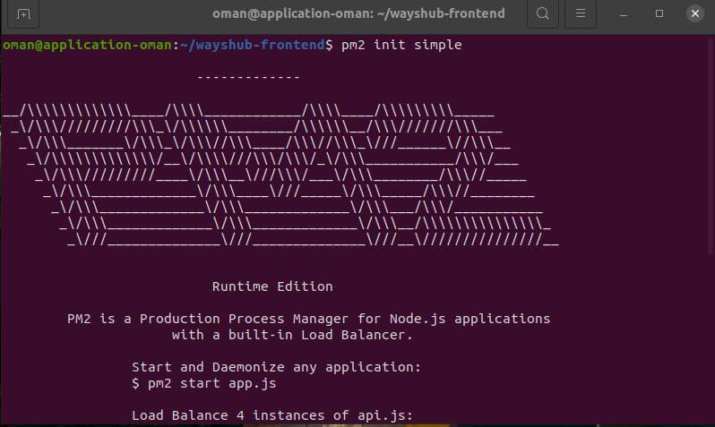
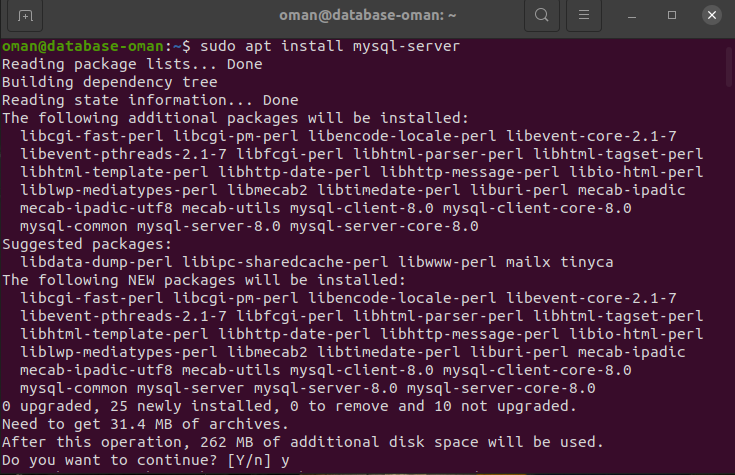
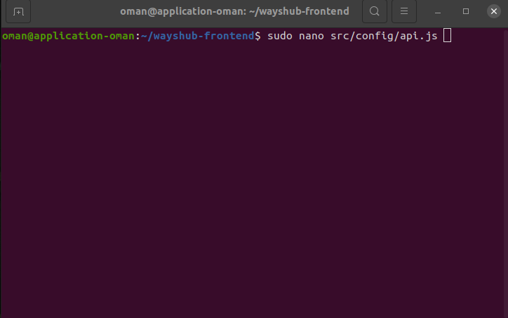
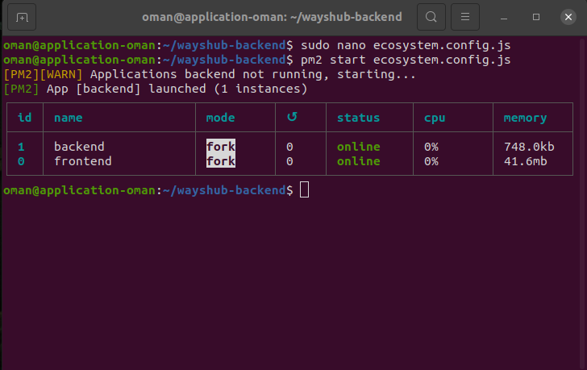

# Cloud Computing and IDCH

## Membuat Server dan VPC Network

### VPC Network
- Langkah pertama login di akun IDCloudHost.
- Selanjutnya buat VPC Network dengan memilih menu ```NETWORK``` lalu pilih ```New``` dan masuk ke menu Create New Network Resource. 
- Pada menu ```Network resource``` pilih VPC (Virtual Private Cloud) Network. 
- Lalu pada menu ```Location``` pilih Indonesia, SouthJKT-a atau NorthJKT-a untuk penyimpanan servernya. 
- Kemudian pada menu ```Name``` masukkan nama network yang di inginkan.
- Untuk menyelesaikan pembuatan VPC Network pilih ```Create``` <br>
 <br>

### Membuat Server
- Langkah pertama login di akun IDCloudHost.
- Selanjutnya pilih menu ```COMPUTE``` lalu pilih ```New``` dan masuk ke menu Create New Network Resource.
- Pada menu ```Choose type``` pilih Virtual Machine.
- Lalu pada menu ```Choose OS``` pilih Ubuntu version 20.04 lts.
- Kemudian pada menu ```Choose size``` pilih dengan spesifikasi 1 CPU, 1 GB RAM, dan 20 GB Disk.
- Lalu pada menu ```Location``` pilih Indonesia, SouthJKT-a atau NorthJKT-a untuk penyimpanan servernya.
- Selanjutnya pada menu ```Public IP``` centang biru Crete a public IPv4 address for the resource.
- Pada menu menu ```VPC Network``` pilih nama VPC Network yang telah dibuat tadi.
- Lalu pada menu ```Billing account``` pilih Dumbways Mentor Pre-payment. 
- Kemudian pada menu ```Username``` masukkan username yang diinginkan.
- Apabila sudah, pada menu ```Password```masukkan password yang di inginkan sesuai ketentuan yang diberikan. setelah itu pada menu ```Confirm Password``` masukkan kembali password yang sebelum nya telah di masukkan pada menu ```password```
- Pada menu ```SSH``` opsional untuk pengisian nya.
- Selanjutnya pada menu ```Resource name``` masukkan hostname server dengan ```application-oman``` untuk server aplikasi dan ```database-oman``` untuk server database.
- Untuk menyelesaikan pembuatan server pilih ```Create``` <br>
 <br>
 <br>
 <br>

## Setup Frontend
- Langkah awal masuk ke dalam server applikasi menggunakan ssh ```ssh oman@103.174.114.40``` <br>
 <br>
- Selanjutnya jalankan perintah ```sudo apt update``` dan ```sudo apt upgrade```
- Lalu install nginx dengan perintah ```sudo apt install nginx -y``` <br>
 <br>
- Untuk melihat version dari nginx dengan perintah ```nginx -v``` <br>
 <br>
- Apabila ingin melihat status dari nginx dengan perintah ```sudo systemctl status nginx``` <br>
 <br>
- Langkah selanjutnya adalah menginstall nvm (node version manager) dengan perintah ```curl -o- https://raw.githubusercontent.com/nvm-sh/nvm/v0.39.1/install.sh | bash``` <br>
 <br>
- Kemudian jalankan perintah ```exec bash``` agar dapat membaca nvm yang telah terinstall <br>
 <br>
- Untuk menginstall nvm dengan version yang di inginkan menggunakan perintah ```nvm install 14``` disini saya menginstall versi 14 <br>
 <br>
- Lalu untuk melihat version dari nvm dan npm yang telah terinstall dengan perintah ```node -v``` dan ```npm -v``` <br>
 <br>
- Selanjutnya jalankan perintah ```npm install pm2 -g``` untuk menginstall pm2 agar aplikasi dapat berjalan di background <br>
 <br>
- Kemudian clone aplikasi frontend wayshub dari repository github dengan perintah ```git clone https://github.com/dumbwaysdev/wayshub-frontend.git``` <br>
 <br>
- Apabila sudah, masuk ke dalam directory aplikasi frontend wayshub dengan perintah ```cd wayshub-frontend```
- Setelah masuk di dalam directory aplikasi frontend wayhub maka jalankan perintah ```npm install``` atau ```npm i``` untuk menginstall module node.js <br>
 <br>
- Selanjutnya install ecosystem dari pm2 dengan perintah ```pm2 init simple``` <br>
 <br>
- Apabila sudah, masuk ke dalam file ecosystem pm2 dengan perintah ```sudo nano ecosystem.config.js``` kemudian ganti name menjadi ```frontend``` dan script ```npm start```<br>
 <br>
- Kemudian jalankan aplikasi wayshub frontend dengan perintah ```pm2 start ecosystem.config.js``` <br>
 <br>
- Untuk mengecek apakah aplikasi sudah berjalan, buka web browser dan masukkan IP dan port ```103.174.114.40:3000``` dari aplikasi. <br>
 <br>

# Managed Database and Setup Backend

## Manged Database
- Langkah pertama masuk ke dalam server database yang telah dibuat menggunakan ssh ```ssh oman@103.226.138.108``` <br>
 <br>
- Selanjutnya jalankan perintah ```sudo apt update``` dan ```sudo apt upgrade```
- Kemudian install mysql server dengan perintah ```sudo apt install mysql-server``` <br>
 <br>
- Lalu jalankan perintah ```sudo mysql_secure_installation``` untuk memberi password dan beberapa konfigurasi dari mysql <br>
 <br>
 <br>
 <br>
- Apabila sudah masuk ke mysql dengan perintah ```sudo mysql -u root -p``` <br>
 <br>
- Lalu create user dari mysql dengan perintah ```CREATE USER 'oman'@'%' IDENTIFIED BY 'oman1122'; ``` <br>
 <br>
- Apabila sudah beri hak akses penuh kepada user dengan perintah ```GRANT ALL PRIVILEGES ON *.* TO 'oman'@'%';``` <br>
 <br>
- Selanjutnya reload mysql dengan perintah ```FLUSH PRIVILEGES;``` lalu keluar dari mysql<br>
 <br>
- Kemudian masuk ke mysql dengan user yang telah dibuat dengan perintah ```mysql -u oman -p``` <br>
 <br>
- Apabila sudah jalankan perintah ```CREATE DATABASE wayshub;``` untuk membuat database dengan nama wayshub <br>
 <br>
- Untuk melihat database yang telah dibuat dengan perintah ```SHOW DATABASES;``` <br>
 <br>
- Selanjutnya masuk ke dalam database yang telah dibuat dengan perintah ```USE wayshub;``` <br>
 <br>
- Untuk melihat isi dari database dengan perintah ```SHOW TABLES;``` <br>
 <br>
- Apabila sudah keluar dari mysql kemudian jalankan perintah ```sudo nano /etc/mysql/mysql.conf.d/mysqld.cnf``` ubah ```bind-address``` dan ```mysql- Kemudian jalankan aplikasi wayshub frontend dengan perintah ```pm2 start ecosystem.config.js``` <br>x-bind-address``` dengan IP 0.0.0.0 agar dapat diakses oleh seluruh IP Host <br>
 <br>
- Selanjutnya restart mysql dengan perintah ```sudo systemctl restart mysql``` <br>
 <br>

## Setup Backend
- Langkah awal masuk ke dalam server aplikasi dengan perintah ```ssh oman@103.174.114.40```
- Selanjutnya clone aplikasi wayshub backend dengan perintah ```git clone https://github.com/dumbwaysdev/wayshub-backend.git``` <br>
 <br>
- Kemudian masuk ke dalam directory wayshub-backend ```cd wayshub-backend```
- Lalu instal node module dengan perintah ```npm install``` atau ```npm i``` <br>
 <br>
- Apabila sudah, jalankan perintah ```sudo nano config/config.json``` untuk mengubah pada block ```development``` username, password, database, dan host sesuai dengan mysql <br>
 <br>
- Lalu install sequelize dengan perintah ```npm install sequelize-cli -g``` <br>
 <br>
- Untuk melihat version dari sequelize dengan perintah ```sequelize --version``` <br>
 <br>
- Jalankan perintah ```npx sequelize db:migrate``` untuk memigrasi data ke database <br>
 <br>
- Selanjutnya masuk ke server database dan cek apakah data sudah termigrasi <br>
 <br>
- Kemudian kembali ke server aplikasi install ecosystem pm2 dengan perintah ```pm2 init simple``` dan masuk ke file ecosystem dengan perintah ```sudo nano ecosystem.config.js``` lalu ganti name menjadi ```backend``` dan script ```npm start``` <br>
 <br>
- Jalankan aplikasi wayshub backend dengan perintah ```pm2 start ecosystem.config.js``` 
- Untuk mengecek apakah aplikasi sudah berjalan, buka web browser dan masukkan IP dan port ```103.174.114.40:5000``` dari aplikasi. <br>
 <br>
- Kemudian masuk ke directory wayshub-frontend ```cd wayshub-frontend```
- Selanjutnya jalankan perintah ```sudo nano wayshub-frontend/src/config/api.js``` untuk menghubungkan frontend dan backend lalu ubah bashURL dengan IP dan port dari aplikasi backend ```bashURL: "http;//103.174.114.40:5000/api/v1" ```  <br>
 <br>
 <br>
- Kemudian masuk ke directory wayshub-frontend ```cd wayshub-frontend``` jalankan kembali aplikasi wayshub frontend dengan perintah ```pm2 start ecosystem.config.js``` <br>
- Untuk mengecek apakah aplikasi wayshub frontend dan backend sudah terhubung buka web browser dan masukkan IP dan port aplikasi <br>
 <br>
 <br>
 <br>
 <br>