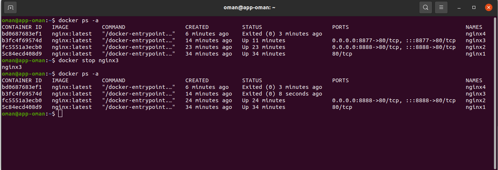
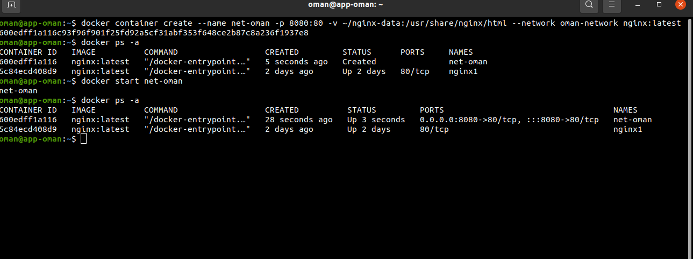
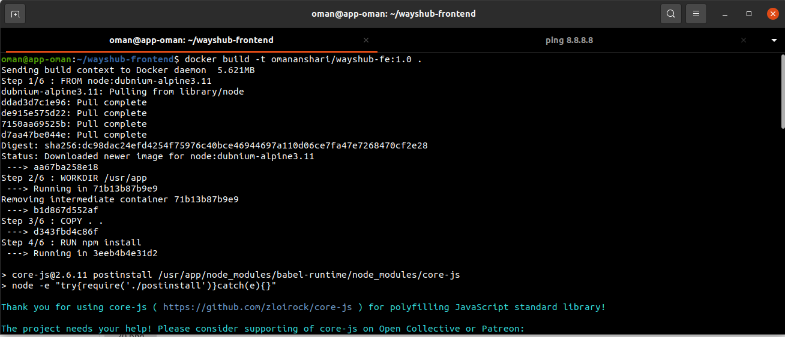
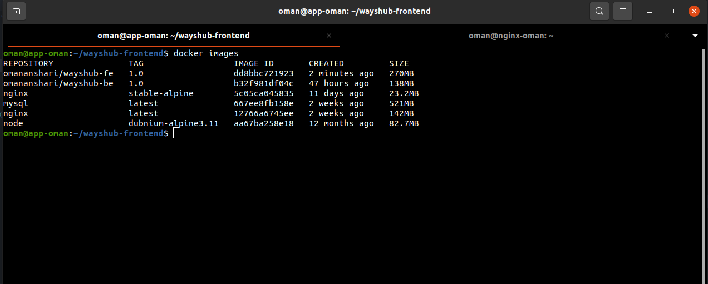
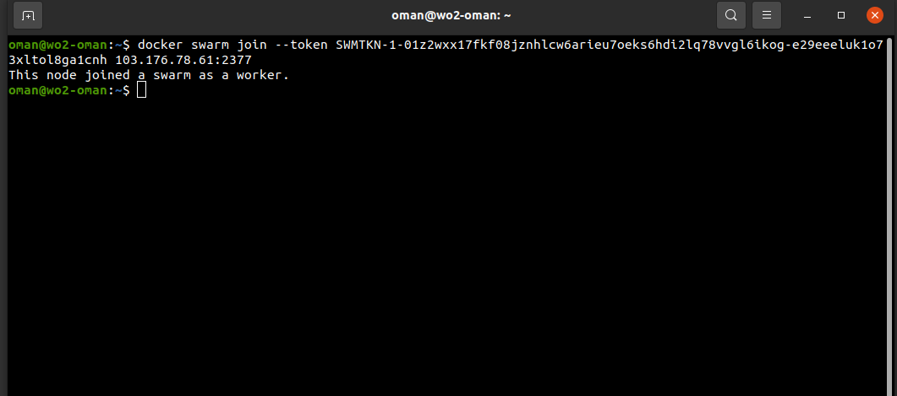
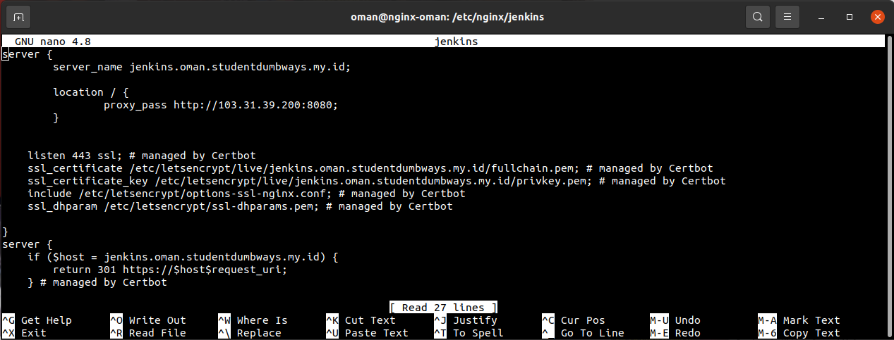

# DOCKER
Docker adalah perangkat lunak yang dapat digunakan untuk build, test, dan deploy aplikasi dengan cepat menggunakan teknologi yang disebut container. 

## Installation Docker Engine
- Buat server di IDCH.
- Buat akun pada docker hub. <br>
 <br>
- Masuk ke server IDCH yang telah dibuat ```ssh oman@103.174.114.40``` <br>
 <br>
- Jalankan perintah ```sudo apt update``` lalu ```sudo apt install ca-certificates curl gnupg lsb-release``` <br>
 <br>
 <br>
- Kemudian ```curl -fsSL https://download.docker.com/linux/ubuntu/gpg | sudo gpg --dearmor -o /usr/share/keyrings/docker-archive-keyring.gpg``` <br>
 <br>
- Selanjutnya ```echo "deb [arch=$(dpkg --print-architecture) signed-by=/usr/share/keyrings/docker-archive-keyring.gpg] https://download.docker.com/linux/ubuntu $(lsb_release -cs) stable" | sudo tee /etc/apt/sources.list.d/docker.list > /dev/null``` <br>
 <br>
- Lalu jalankan ```sudo apt update``` dan ```sudo apt install docker-ce docker-ce-cli containerd.io``` <br>
 <br>
 <br>
- Cek version docker dengan perintah ```docker -v``` <br>
 <br>
- Jalankan perintah ```sudo usermod -aG docker oman```untuk bisa menjalankan perintah docker tanpa menggunakan sudo <br>
 <br>
- ```docker login``` adalah perintah untuk login ke docker hub melalui server <br>
 <br>

## Perintah-perintah pada Docker
- ```docker ps``` atau ```docker container ls``` adalah perintah untuk melihat container yang sedang berjalan. <br>
 <br>
- ```docker ps -a``` atau ```docker container ls -a``` adalah perintah untuk melihat semua container yang sedang berjalan dan container yang mati. <br>
 <br>
- ```docker pull nginx``` adalah perintah untuk mendownload image nginx dengan tag latest apabila tag tidak dituliskan. <br>
 <br>
- ```docker pull nginx:stable-alpine``` adalah perintah untuk mendownload image nginx dengan tag stable-alpine. <br>
 <br>
- ```docker images``` adalah perintah untuk melihat image yang sudah terdownload <br>
 <br>
- ```docker run -d --name nginx1 nginx:latest``` adalah perintah untuk membuat dan menjalankan suatu container dengan nama nginx1 yang di jalankan pada backgorund dengan image nginx dan tag latest. <br>
 <br>
- ```docker run -d --name nginx2 -p 8888:80 nginx:latest``` adalah perintah untuk membuat dan menjalankan suatu container dengan nama nginx2 yang di jalankan pada background dengan yang di custom menjadi 8888 dari default port nginx 80 dengan image nginx dengan tag latest. <br>
 <br>
 <br>
- ```docker container create --name nginx3 -p 8877:80 nginx:latest``` adalah perintah untuk membuat suatu container tanpa menjalankan dengan nama nginx3 dengan port yang di custom 8877 dari default port 80 dengan image nginx dengan tag latest. <br>
 <br>
- ```docker start nginx3``` atau ```docker container start nginx3``` adalah perintah untuk menjalankan container dengan nama nginx3. <br>
 <br>
- ```docker start bd0687683ef1``` adalah perintah untuk menjalankan container dengan ID container. <br>
 <br>
 <br>
- ```docker stop bd0687683ef1``` adalah perintah untuk memberhentikan container dengan ID container. <br>
 <br>
- ```docker stop nginx3``` adalah perintah untuk memberhentikan container dengan nama container <br>
 <br>
- ```docker rm bd0687683ef1``` adalah perintah untuk menghapus container dengan ID container. <br>
 <br>
- ```docker rm nginx3``` adalah perintah untuk menghapus container dengan nama container. <br>
 <br>
- ```docker exec -it nginx2 bash``` adalah perintah untuk masuk ke dalam container dengan nama image nginx2 dengan tag latest (official image)<br>
 <br>
- ```docker exec -t nginx3 sh``` adalah perintah untuk masuk ke dalam container dengan nama image nginx3 dengan tag alpine. <br>
 <br>
- ```docker logs nginx2``` adalah perintah untuk melihat logs dari container nginx2. <br>
 <br>
- ```docker inspect nginx2``` adalah perintah untuk melihat informasi dari container secara keseluruhan dari container nginx2. <br>
 <br>

### Docker Volume
- ```docker container create --name database -p 3306:3306 -v ~/mysql-data:/var/lib/mysql -e  MYSQL_ROOT_PASSWORD=oman1122 -e MYSQL_DATABASE=wayshub mysql``` adalah perintah untuk membuat suatu container dengan nama database port yang di custom 3306 dari default port 3306 dengan nama volume mysql-data dengan environment MYSQL_ROOT_PASSWORD dan MYSQL_DATABASE. <br>
 <br>
 <br>
 <br>
 <br>

### Docker Network
- ```docker network create oman-network``` adalah perintah untuk membuat network dengan nama oman-network <br>
 <br>
- ```docker network inspect oman-network``` adalah perintah untuk melihat informasi dari network oman-network <br>
 <br>
- ```docker network ls``` adalah perintah untuk melihat network yang ada <br>
 <br>
- ```docker container create --name net-oman -p 8080:80 -v ~/nginx-data:/usr/share/nginx/html --network oman-network nginx:latest``` adalah perintah untuk membuat suatu container dengan nama net-oman dengan posrt custom 8080 dari port default 80, volume bernama nginx-data dengan directory /usr/share/nginx/html join dengan oman-network dan imanges nginx dengan tag latest
 <br>
 <br>
 <br>
- ```docker network disconnect oman-network net-oman``` adalah mengeluarkan container net-oman dari docker net-oman <br>
 <br>
 <br>
- ```docker network rm oman-network``` adalah perintah menghapus network dengan nama oman-network <br>
 <br>

### Deployment Aplikasi Backend
- ```git config --global user.name "NyakTwomanAnshari"``` perintah untuk mengatur username dari user github.
- ```git config --global user.email "oman.anshari@gmail.com"``` perintah untuk mengatur email user github.
- ```git config --list``` perintah yang digunakan untuk melihat user dan email yang digunakan. <br>
 <br>
- Jalankan perintah ```ssh-keygen``` untuk mengenerate ssh keygen.
- Masuk ke directory .ssh dengan perintah ```cd .ssh``` kemudaian lihat isi dari file id_rsa.pub ```cat id_rsa.pub```, selanjutnya copy id_rsa.pub tersebut.
- Selanjutnya masuk ke menu setting pada github pilih SSH dan GPG keys, kemudian pilih new SSH key dan isi title sesuai keinginan dan key dengan SSH yang telah di copy tadi.
- Kemudian clone aplikasi frontend dengan perintah ```git clone git@github.com:NyakTwomanAnshari/wayshub-frontend.git```
- Masuk ke dalam directory wayshub-backend dengan perintah ```cd wayshub-backend```
- Lalu buat sebuah Dockerfile dengan perintah ```nano Dockerfile``` dan isi dengan konfigurasi berikut <br>
 <br>
- Lanjut, jalankan perintah ```docker build -t omananshari/wayshub-be:1.0 .``` untuk build images dengan nama omananshari/wayshub-be dengan tag 1.0 dan titik digunakan untuk membaca Dockerfile
- Kemudian jalankan perintah ```docker push omananshari/wayshub-be:1.0``` untuk push ke registry docker hub dengan nama images omananshari/wayshub-fe:1.0 <br>
 <br>
- Jalankan perintah ```docker container create --name backend -p 5555:5000 omananshari/wayshub-be:1.0``` 
- Masuk ke server nginx, lalu masuk ```cd /etc/nginx``` kemudian buat directory baru ```mkdir wayshub-be``` untuk menyimpan konfigurasi reverse proxy. Selanjutnya buat file untuk melakukan konfigurasi reverse proxy ```sudo nano wayshub``` 
- Buat URL aman menggunakan certbot. Jalankan certbot ```sudo certbot``` lalu pilih URL yang ingin di beri certificated certbot, tunggu hingga selesai. <br>
 <br>
- Pindah ke server aplikasi, lalu jalankan container dengan perintah ```docker start backend``` untuk menjalankan container dengan nama backend
- Masuk ke web browser, kemudian masukkan URL dari aplikasi backend yang  telah di beri certificated certbot ```https://api.oman.studentdumbways.my.id``` <br>
 <br>

### Deployment Frontend
- Pinda ke directory wayshub-frontend dengan perintah ```cd wayshub-frontend```
- Lalu buat sebuah Dockerfile dengan perintah ```nano Dockerfile``` dan isi dengan konfigurasi berikut <br>
 <br>
- Selanjutnya, jalankan perintah ```sudo nano /srcconfig/api.js``` ubah baseURL menjadi URL aplikasi backend <br>
 <br>
- Lanjut, jalankan perintah ```docker build -t omananshari/wayshub-fe:1.0 .``` untuk build images dengan nama omananshari/wayshub-fe dengan tag 1.0 dan titik digunakan untuk membaca Dockerfile<br>
 <br>
 <br>
- Selanjutnya jalankan perintah ```docker login``` untuk masuk ke docker hub
- Kemudian jalankan perintah ```docker push omananshari/wayshub-fe:1.0``` untuk push ke registry docker hub dengan nama images omananshari/wayshub-fe:1.0 <br>
 <br>
 <br>
- Jalankan perintah ```docker container create --name frontend -p 3333:3000 omananshari/wayshub-fe:1.0```
 <br>
- Masuk ke server nginx, lalu masuk ```cd /etc/nginx``` kemudian buat directory baru ```mkdir wayshub-fe``` untuk menyimpan konfigurasi reverse proxy. Selanjutnya buat file untuk melakukan konfigurasi reverse proxy ```sudo nano wayshub```
- Buat URL yang menjadi aman menggunakan certbot. Jalankan certbot ```sudo certbot``` lalu pilih URL yang ingin di beri certificated certbot, tunggu hingga selesai. <br>
 <br>
- Pindah ke server aplikasi, lalu jalankan container dengan perintah ```docker start frontend``` untuk menjalankan container dengan nama forntend <br>
 <br>
- Masuk ke web browser, kemudian masukkan URL dari aplikasi backend yang  telah di beri certificated certbot ```https://oman.studentdumbways.my.id```. <br>
 <br>
 <br>
 <br>

### Docker Compose
- Pertama install engine dari docker compose dengan perintah ```sudo curl -L "https://github.com/docker/compose/releases/download/1.29.2/docker-compose-$(uname -s)-$(uname -m)" -o /usr/local/bin/docker-compose``` <br>
 <br>
- Selanjutnya jalankan perintah ```sudo chmod +x /usr/local/bin/docker-compose``` agar docker compose dapat di jalankan
- Untuk melihat versi docker compose dengan perintah ```docker compose --version``` <br>
 <br>
- Kemudian masuk ke directory wayshub-frontend dengan perintah ```cd wayshub-frontend```
- Lalu buat file docker compose dengan perintah ```nano docker-compose.yml``` dan isi dengan konfigurasi sebagai berikut apabila telah ada images atau konfigurasi yang belum ada images tinggal tambahkan build dan lokasi directory dari aplikasi<br>
 <br>
- Selanjutnya jalankan perintah ```docker-compose up -d``` untuk membuat container dari docker compose <br>
 <br>

# DOCKER SWARM
Docker swarm adalah teknologi yang dibuat untuk memudahkan pendistribusian aplikasi pada docker yang terdiri dari server. Dockers swarm memudahkan kita untuk mengelola container docker yang menggunakan banyak server. <br>
Keuntugan dari Docker Swarm:
- Dapat mengatasi down lebih cepat.
- Mudah dalam scaling application.

## Langkah-langkah Menggunakan Docker Swarm
- Buat server docker dengan nama ```swm-oman``` di IDCH sebagai manager.
- Buat server docker dengan nama ```wo1-oman``` di IDCH sebagai worker1.
- Buat server docker dengan nama ```wo2-oman``` di IDCH sebagai worker2.
- Masuk ke server manager ```ssh oman@103.176.78.61```
- Jalankan perintah ```docker swarm init --advertise-addr 103.176.78.61``` untuk menginisialisasi bahwa server ini sebagai manager dan akan mengenerate join token sebagai worker<br>
 <br>
- Masuk ke server worker1 ```ssh oman@103.172.204.239```
- Copy generate join token pada terminal ```docker swarm join --token SWMTKN-1-01z2wxx17fkf08jznhlcw6arieu7oeks6hdi2lq78vvgl6ikog-e29eeeluk1o73xltol8ga1cnh 103.176.78.61:2377``` <br>
 <br>
- Masuk ke server worker2 ```ssh oman@103.174.115.181```
- Copy generate join token pada terminal ```docker swarm join --token SWMTKN-1-01z2wxx17fkf08jznhlcw6arieu7oeks6hdi2lq78vvgl6ikog-e29eeeluk1o73xltol8ga1cnh 103.176.78.61:2377``` <br>
 <br>
- Kembali ke server manager, jalankan perintah ```docker node ls``` untuk melihat informasi dari node yang telah terhubung<br>
 <br>
- Selanjutnya jalankan perintah ```git clone https://github.com/dumbwaysdev/dumbways-microservices.git``` di server manager, worker1 dan worker2<br>
 <br>
- Lanjut pada server manager masuk ke aplikasi yang sudah di clone tadi ```cd dumbways-microservices``` kemudian jalankan perintah ```docker-compose build``` <br>
 <br>
- Lalu untuk membuat service jalankan perintah ```docker docker stack deploy --compose-file docker-compose.yml application``` <br>
 <br>
 <br>
- Kemudian scale service application_todo-profile tersebut dengan perintah ```docker service scale application_todo-profile=5``` <br>
 <br>
- Selanjutnya kita lihat di setiap server manager, worker1, dan worker2 <br>
 <br>
 <br>
 <br>
- Buka web browser untuk memastikan apakah aplikasi tadi sudah berjalan dengan memasukkan IP server manager dan port berjalannya aplikasi <br>
 <br>

# CI/CD (JENKINS)
CI (Continuous Integration) dan CD (Continuous Delevery) proses otomisasi untuk memastikan bahwa kode aplikasi selalu baru, selalu diuji dan siap digunakan pada waktunya. <br>
Beberapa Tools CI/CD:
- GitLabCI
- TravisCI
- CircleCI
- Jenkins

## Langkah-langkah menginstall dan setup CI/CD Jenkins
- Buat server dengan nama ```jenkins-oman``` di IDCH.
- Masuk ke dalam server tersebut ```ssh oman@103.31.39.200```
- Buka web browser login halaman cloudflare.com dengan akun mentor
- Selanjutnya pilih domain ```studentdumbways.my.id``` lalu pilih ```add record``` dan isi pada kolom nama dengan ```jenkins.oman``` dan kolom IPv4 dengan ```103.176.78.66``` IP server nginx. 
- Selanjutnya masuk ke dalam server nginx tersebut
- Kemudian jalankan perintah ```cd /etc/nginx/``` lalu buat sebuah directory baru untuk menyimpan konfigurasi reverse proxy dengan perintah ```mkdir jenkins```
- Masuk ke directory jenkins ```cd jenkins``` lalu buat file dengan nama jenkins untuk menyimpan konfigurasi dengan perintah ```sudo nano jenkins``` dan isi konfigurasi sebagai berikut <br>
 <br>
- Cek apakah konfigurasi yang dibuat benar atau salah dengan perintah ```sudo nginx -t```
- Selanjutnya pindah kembali ke directory nginx lalu jalankan perintah ```sudo nano nginx.conf``` pada baris include masukkan directory yang telah di buat konfigurasi nya <br>
 <br>
- Kemudian restart nginx dengan perintah ```sudo systemctl restart nginx```
- Buat URL menjadi aman menggunakan certbot. Jalankan certbot ```sudo certbot``` lalu pilih URL yang ingin di beri certificated certbot, tunggu hingga selesai. <br>
 <br>
 <br>
- Masuk ke server jenkins, lalu jalankan perintah ```sudo apt update``` dan ```sudo apt install openjdk-11-jre``` <br>
 <br>
- Selanjutnya ```curl -fsSL https://pkg.jenkins.io/debian-stable/jenkins.io.key | sudo tee /usr/share/keyrings/jenkins-keyring.asc > /dev/null``` lalu ```echo deb [signed-by=/usr/share/keyrings/jenkins-keyring.asc] https://pkg.jenkins.io/debian-stable binary/ | sudo tee /etc/apt/sources.list.d/jenkins.list > /dev/null```
- Jalankan kembali ```sudo apt update``` dan install jenkins ```sudo apt install jenkins``` <br>
 <br>
- Untuk melihat apakah jenkins sudah berjalan dengan perintah ```sudo systemctl status jenkins``` <br>
 <br>
- Apabila proses instalasi berhasil, selanjutnya masuk ke web browser masukkan URL jenkins ```https://jenkins.oman.studentdumbways.my.id`` <br>
 <br>
- Kemudian ketik perintah pada server jenkins ```sudo cat /var/lib/jenkins/secrets/initialAdminPassword``` <br>
 <br>
- Kembali ke web browser yang sudah dijalankan jenkins pilih ```install suggested plugins``` dan tunggu hingga plugins berhasil di install <br>
 <br>
 <br>
- Apabila plugins berhasil di install, selanjutnya ```Create First Admin User``` masukkan username, password, confirm password, dan email lalu pilih ```save and continue```<br>
[image docker](assets/98.png) <br>
- Masuk ke menu ```Instance Configuration``` pilih ```save and finish``` <br>
 <br>
- Maka akan masuk ke halaman ```Jenkins is ready!``` lalu pilih ```Start using Jenkins``` <br>
 <br>
 <br>
- Kemudian pilih menu ```Manage Jenkins``` lalu ```Manage Plugins``` pada kolom pencarian cari ```SSH Agent``` kemudian pilih ```install without restart``` tunggu hingga proses installasi hingga success <br>
 <br>
 <br>
 <br>
- Selanjutnya pilih menu ```Manage Jenkins``` lalu pilih ```Manage Credentials``` kemudian pilih ```Global``` dan ```Add Credentials```. Selanjutnya isi sesuai pada gambar <br>
 <br>
 <br>
 <br>
 <br>
 <br>
- Pergi ke web browser buka ```github.com``` dan buat sebuah repository baru dengan nama ```wayshub-jenkins```
- Kemudian masuk ke server ```oman@app-oman``` lalu ubah remote dengan ```git remote set-url origin git@github.com:NyakTwomanAnshari/wayshub-jenkins.git``` <br>
- Selanjutnya buat sebuah file dengan nama Jenkins dengan konfigurasi sebagai berikut ```sudo nano Jenkinsfile``` <br>
 <br>
- Lalu push semua file di directory ```wayshub-frontend``` ke repository github```wayshub-jenkins```
 <br>
- Pada repository wayshub-jenkins pilih menu ```setting``` lalu pilih menu ```Webhooks``` dan pili ```add webhooks``` kemudian masukkan url jenkins disertai dengan /github-webhook/ ```https://jenkins.oman.studentdumbways.my.id/github-webhook/``` untuk mentrigger perubahan pada GitHub sehingga jenkins otomatis re-build dan akhiri dengan pilih save<br>
 <br>
- Kembali ke dashboard Jenkins pilih ```New Item``` lalu masukkan pada kolom item name sesuai keinginan dan pilih ```Pipeline``` <br>
 <br>
- Pada menu ```Build Triggers``` centang ```GitHub hook trigger for GITScm polling``` <br>
 <br>
- Selanjutnya pada menu ```Pipeline``` masukkan repository yang telah dibuat tadi, pilih ```Credentials``` ```oman(GitHub)``` dan ```Branch Specifer (blank or any)``` dengan ```*/main``` <br>
 <br>
 <br>
- Kemudian pilih ```Build Now``` tunggu sampai proses build selesai <br>
 <br>