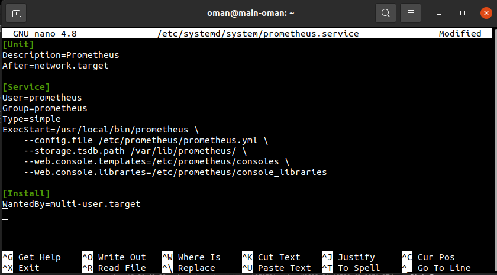
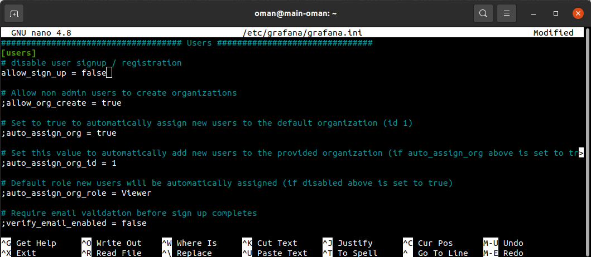
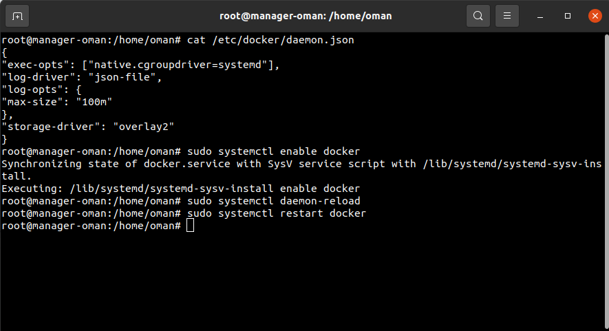

# MONITORING

## Instalation Node Exporter
- Pertama install node exporter dengan perintah ```wget https://github.com/prometheus/node_exporter/releases/download/v0.15.2/node_exporter-0.15.2.linux-amd64.tar.gz``` <br>
 <br>

- Kemudian extract file node exporter dengan perintah ```tar -xf node_exporter-0.15.2.linux-amd64.tar.gz``` <br>


- Pindahkan node exporter file ke ```/usr/local/bin``` dengan perintah ```sudo mv node_exporter-0.15.2.linux-amd64/node_exporter /usr/local/bin``` <br>
 <br>

- Tambahkan user node exporter dengan perintah ```sudo useradd -rs /bin/false node_exporter``` <br>
<br>
- Buat config service di ```/etc/systemd/system/``` dengan perintah ```cd /etc/systemd/system``` lalu jalankan ```sudo nano node_exporter.service``` <br>
 <br>

- Kemudian jalankan perintah daemon reload ```sudo systemctl daemon-reload``` <br>
 <br>

- Selanjutnya jalankan node exporter service ```sudo systemctl enable node_exporter``` dan buat enable node exporter ```sudo systemctl start node_exporter```<br>
 <br>

- Cek status dari node exporter ```sudo systemctl status node_exporter```<br>
 <br>

- Masuk ke web browser dan masukkan IP dari server dan port node exporter ```103.226.139.131:9100``` <br>
 <br>

## Instalation Prometheus
- Install prometheus dengan perintah```wget https://github.com/prometheus/prometheus/releases/download/v2.1.0/prometheus-2.1.0.linux-amd64.tar.gz``` <br>
 <br>

- Kemudian extract file prometheus dengan perintah ```tar -xf node_exporter-2.1.0.linux-amd64.tar.gz``` <br>
 <br>

- Pindahkan file yang sudah di extract ke ```/usr/local/bin``` dengan perintah ```sudo mv prometheus-2.1.0.linux-amd64/prometheus prometheus-2.1.0.linux-amd64/promtool /usr/local/bin``` <br>
 <br>

- Lalu buat directory baru dengan nama prometheus dengan perintah ```sudo mkdir /etc/prometheus /var/lib/prometheus``` <br>
<br>

- Pindah file yang telah di extract tadi ke directory yang telah dibuat dengan perintah ```sudo mv prometheus-2.1.0.linux-amd64/consoles prometheus-2.1.0.linux-amd64/console_libraries /etc/prometheus``` <br>
<br>

- Buat konfigurasi untuk prometheus dengan perintah ```sudo nano /etc/prometheus/prometheus.yml``` <br>
<br>

- Tambahkan user prometheus dengan perintah ```sudo useradd -rs /bin/false prometheus``` <br>
<br>

- Change owner ```sudo chown -R prometheus: /etc/prometheus /var/lib/prometheus``` <br>
<br>

- Buat konfigurasi dengan perintah ```sudo nano /etc/systemd/system/prometheus.service``` <br>
<br>

- Kemudian jalankan perintah daemon reload ```sudo systemctl daemon-reload``` <br>
 <br>

- Selanjutnya jalankan node exporter service ```sudo systemctl enable prometheus``` dan buat enable node exporter ```sudo systemctl start prometheus```<br>
 <br>

- Cek status dari node exporter ```sudo systemctl status prometheus```<br>
 <br>

- Masuk ke web browser dan masukkan IP dari server dan port prometheus ```103.226.139.131:9090``` <br>
 <br>
 <br>
 <br>

## Instalation Grafana
- Install grafana dengan perintah ```sudo su``` lalu ```sudo wget -q -O - https://packages.grafana.com/gpg.key | apt-key add -``` <br>
 <br>

- Selanjutnya jalankan perintah ```ctrl+d``` lalu ```sudo add-apt-repository "deb https://packages.grafana.com/oss/deb stable main"``` <br>
 <br>

- Kemudian install grafana dengan perintah ```sudo apt install grafana -y``` <br>
 <br>

- Jalankan perintah ```sudo systemctl enable grafana-server``` lalu ```sudo systemctl start grafana-server``` dan ```sudo systemctl status grafana-server``` <br>
 <br>

- Lalu jalankan perintah ```sudo nano /etc/grafana/grafana.ini``` sesuaikan konfigurasi seperti ada gambar <br>
 <br>
 <br>

- Jalankan perintah ```sudo systemctl restart grafana-server``` dan ```sudo systemctl status grafana-server``` <br>
 <br>

- Buka web browser masukkan IP dari server dan port grafana ```103.226.139.131:3000``` <br>
 <br>
 <br>
 <br>
 <br>
 <br>
 <br>
 <br>
 <br>
 <br>
 <br>
 <br>
 <br>
 <br>
 <br>

# ANSIBLE

## Instalation Ansible
- Jalankan perintah ```sudo apt update``` <br>
 <br>

- Jalankan perintah ```sudo apt install software-properties-common``` <br>
 <br>

- Jalankan perintah ```sudo add-apt-repository --yes --update ppa:ansible/ansible``` <br>
 <br>

- Jalankan perintah ```sudo apt install ansible``` <br>
 <br>

- Untuk melihat versi dari ansible ```ansible --version``` <br>
 <br>

## Setup Ansible

- Buat directory dengan nama ansible ```mkdir ansible``` untuk menyimpan konfigurasi ansible <br>
 <br>

- Masuk ke server lalu copy id_rsa ```cat .ssh/id_rsa``` dan copy juga id_rsa.pub ke authorized_keys <br>
 <br>
 <br>

- Kemudian buat file dengan nama sshkey.pem ```sudo nano sshkey.pem``` dan paste id_rsa <br>
 <br>

- Jalankan perintah ```ansible all -m ping``` untuk mengecek apakah sudah terhubung ke server<br>
 <br>

- Jalankan perintah ```sudo nano Inventory``` untuk menyimpan host server tujuan <br>
 <br>

- Selanjutnya buat file ansible.cfg ```sudo nano ansible.cfg``` dan buat konfigurasi seperti pada gambar <br>
 <br>


### Install Nginx

- Buat file dengan nama nginx.yml ```sudo nano nginx.yml``` untuk membuat konfigurasi untuk menginstall nginx <br>
 <br>

- Kemudian cek apakah syntax nya sudah benar atau belum dengan perintah ```ansible-playbook --syntax-check nginx.yml``` <br>
 <br>

- Jalankan konfigurasi tadi dengan perintah ```ansible-playbook nginx.yml``` <br>
 <br>

- Masuk ke web browser untuk melihat apakah nginx telah berjalan dengan memasukkan IP server dan port nginx <br>
 <br>

### Install Docker

- Buat file dengan nama docker.yml ```sudo nano docker.yml``` untuk membuat konfigurasi untuk menginstall docker <br>
 <br>

- Kemudian cek apakah syntax nya sudah benar atau belum dengan perintah ```ansible-playbook --syntax-check docker.yml``` <br>
 <br>

- Jalankan konfigurasi tadi dengan perintah ```ansible-playbook docker.yml``` <br>
 <br>

# KUBERNETES

## Installation Kubernetes
- Masuk ke root ```sudo su```
- Jalankan perintah ```swapoff -a; sed -i '/swap/d' /etc/fstab```
- ```cat >>/etc/sysctl.d/kubernetes.conf<<EOF```
- ```net.bridge.bridge-nf-call-ip6tables = 1```
- ```net.bridge.bridge-nf-call-iptables = 1```
- ```EOF``` 
- ```sysctl --system```<br>
 <br>

- Install docker ```wget -O - https://gist.githubusercontent.com/sgnd/8ac5130ec4439985d14d118c77b7b418/raw/c351376fd4d7afbca587f8ed1f2fd57f87e113ce/docker.sh | bash``` <br>
 <br>

- Setup docker daemon ```cat <<EOF | sudo tee /etc/docker/daemon.json```
> {
> "exec-opts": ["native.cgroupdriver=systemd"],
> "log-driver": "json-file",
> "log-opts": {
> "max-size": "100m"
> },
> "storage-driver": "overlay2"
> }
> EOF <br>
 <br>

- Jalankan perintah ```sudo systemctl enable docker```
- ```sudo systemctl daemon-reload```
- ```sudo systemctl restart docker``` <br>
 <br>

- Install kubelet, kubeadm, kubectl dengan perintah ```sudo apt -y install curl apt-transport-https```
- ```curl -s https://packages.cloud.google.com/apt/doc/apt-key.gpg | sudo apt-key add -```
- ```echo "deb https://apt.kubernetes.io/ kubernetes-xenial main" | sudo tee /etc/apt/sources.list.d/kubernetes.list```
- ```sudo apt update -y; sudo apt -y install kubelet kubeadm kubectl``` <br>
 <br>

- Kubeadm setup, jalankan perintah ```sudo kubeadm init --apiserver-advertise-address=103.171.85.240 --pod-network-cidr=192.168.0.0/16  --ignore-preflight-errors=all``` <br>
 <br>

- Kubeconfig, jalankan perintah ```mkdir -p $HOME/.kube```
- ```sudo cp -i /etc/kubernetes/admin.conf $HOME/.kube/config```
- ```sudo chown $(id -u):$(id -g) $HOME/.kube/config``` <br>
 <br>

- Config network perintah ```kubectl --kubeconfig=/etc/kubernetes/admin.conf create -f https://projectcalico.docs.tigera.io/manifests/calico.yaml``` <br>
- ```kubectl get pods --all-namespaces```
 <br>

- Join cluster perintah ```kubeadm token create --print-join-command```
- ```kubectl get nodes``` <br>
 <br>

- Change label dengan perintah ```kubectl label node worker node-role.kubernetes.io/worker=worker``` <br>
 <br>