# Setup Jenkins

## Install and Setup Jenkins
- Buat file ansible dengan nama ```sudo nano jenkins.yml``` untuk menginstall jenkins <br>
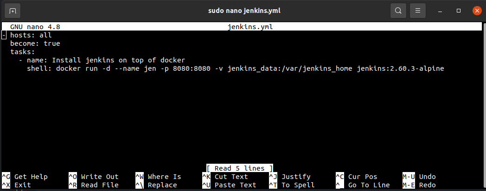 <br>

- Clone terlebih dahulu aplikasi frontend dan backend ```git clone git@github.com:NyakTwomanAnshari/dumbflix-frontend.git``` dan ```git clone git@github.com:NyakTwomanAnshari/dumbflix-backend.git```

- Masuk ke directory ```cd dumbflix-frontend``` dan ```cd dumbflix-backend```
  
- Ubah nama directory ```mv dumbflix-frontend fe-dumbflix``` dan ```mv dumbflix-backend be-dumbflix```
  
- Selanjutnya buat branch dengan nama production ```git branch production```

- Jalankan perintah ```git checkout production``` untuk berpindah ke branch production
  
- Selanjutnya buat sebuah file dengan nama Jenkins dengan konfigurasi sebagai berikut ```sudo nano Jenkinsfile```

- Push semua file di directory ```fe-dumbflix``` ke repository github```fe-dumbflix```


- Push semua file di directory ```be-dumbflix``` ke repository github```be-dumbflix```


- Pada repository wayshub-jenkins pilih menu ```setting``` lalu pilih menu ```Webhooks``` dan pili ```add webhooks``` kemudian masukkan url jenkins disertai dengan /github-webhook/ ```https://jenkins.oman.studentdumbways.my.id/github-webhook/``` untuk mentrigger perubahan pada GitHub sehingga jenkins otomatis re-build dan akhiri dengan pilih save<br>
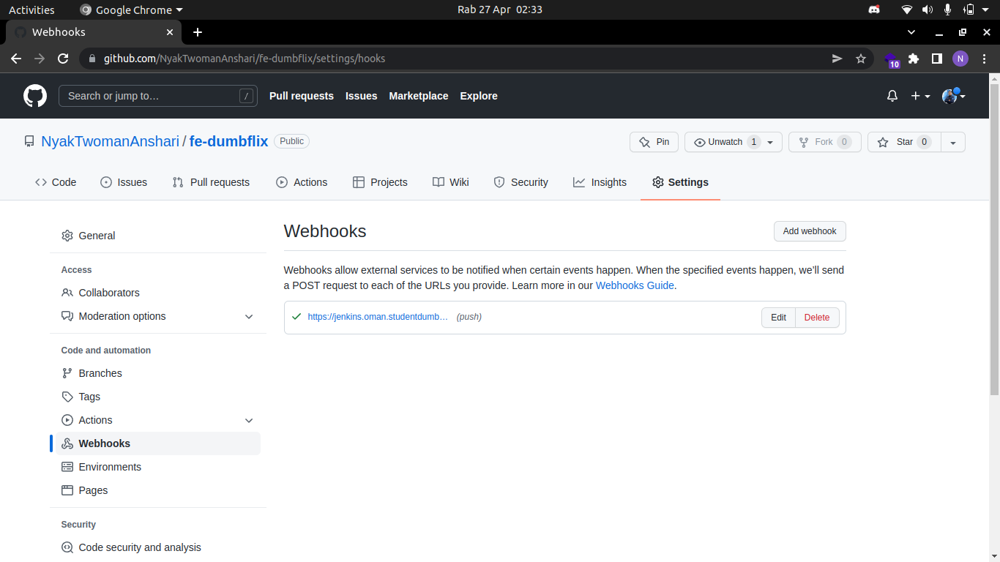 <br>

- Masuk ke web browser ketik ```https://jenkins.oman.studentdumbways.my.id```
- Kemudian jalankan ```docker exec jenkins cat /var/jenkins_home/secrets/initialAdminPassword``` untuk melihat initialAdminPassword <br>
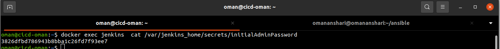 <br>

- Setup plugins Jenkins sesuai recomendation
- Lalu masuk ke ```manage jenkins``` pilih ```credentials``` lalu pilih ```add credentials``` <br>
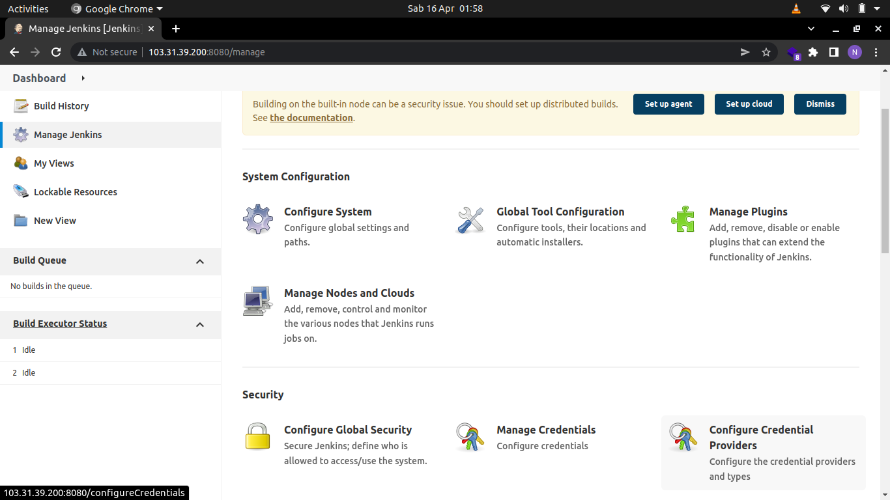 <br>
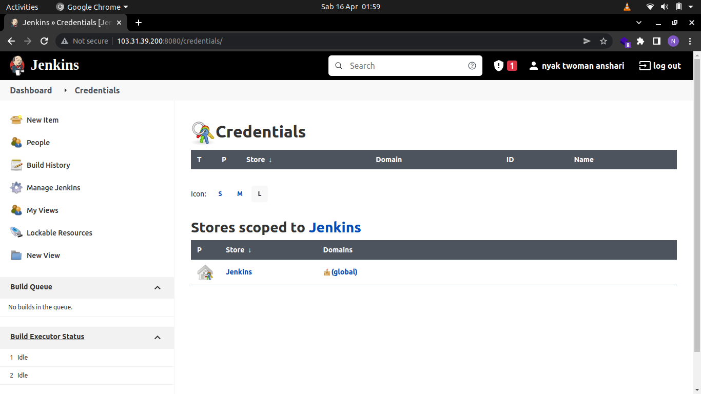 <br>
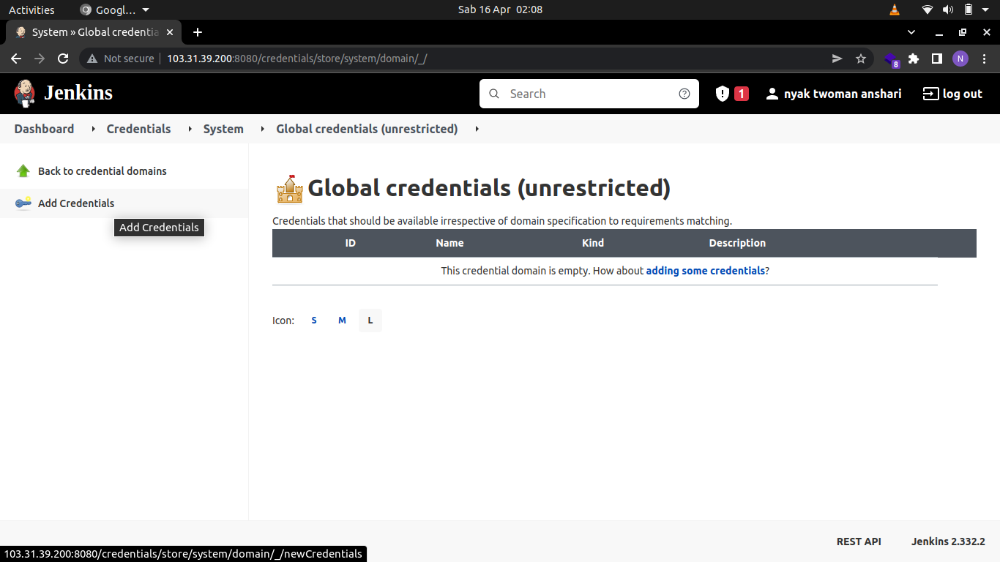 <br>
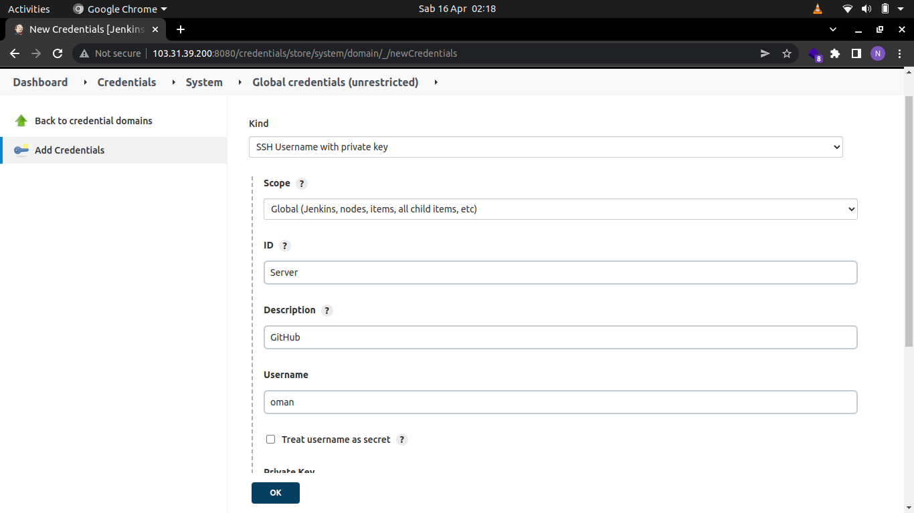 <br>

- Kembali ke dashboard pilih ```manage jenkins``` pilih  ```manage plugins``` lalu cari ```SSH Agent``` di kolom pencarian selanjutnya download without restart <br>
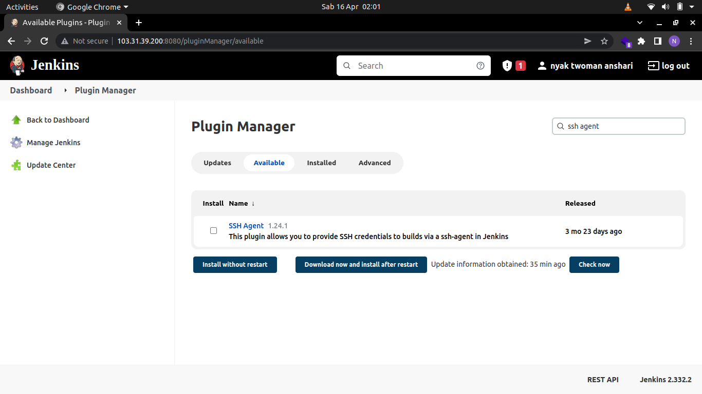 <br>
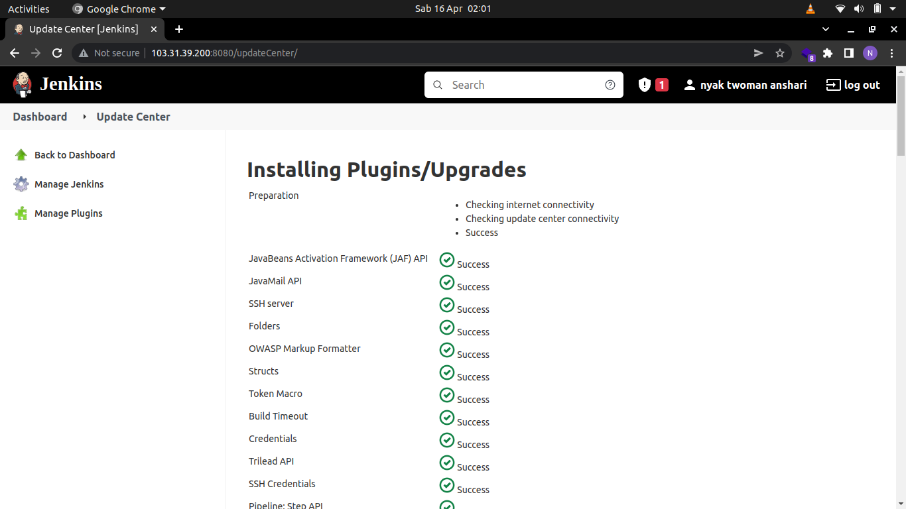 <br>

- Masuk ke dashboard kembali pilih ```New Item``` isi pada kolom sesuai dengan nama aplikasi dan pilih ```Pipeline``` <br>
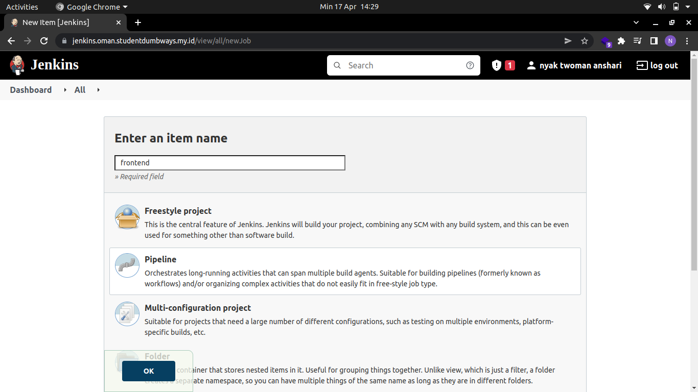 <br>

- Pada menu ```Build Triggers``` centang ```GitHub hook trigger for GITScm polling``` <br>
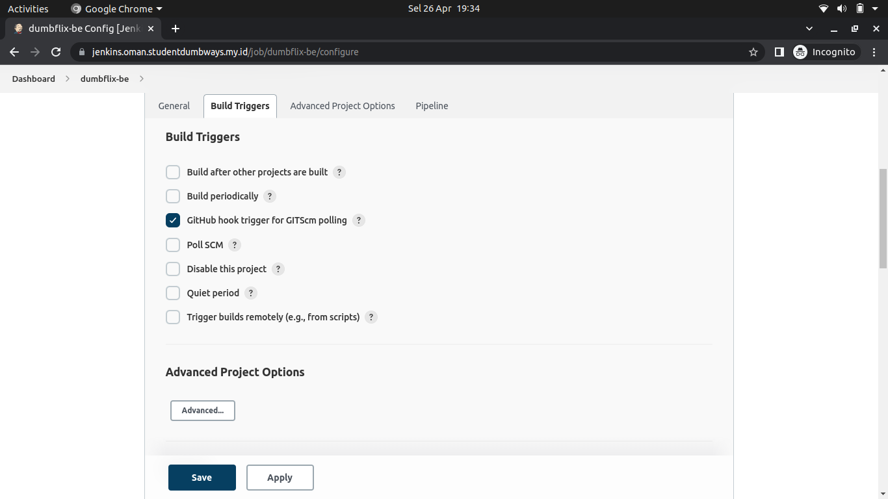 <br>

- Selanjutnya pada menu ```Pipeline``` masukkan repository yang telah dibuat tadi, pilih ```Credentials``` ```oman(GitHub)``` dan ```Branch Specifer (blank or any)``` dengan ```*/production``` <br>
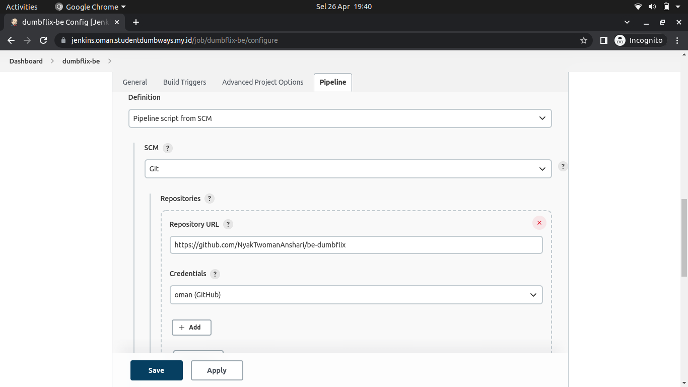 <br>
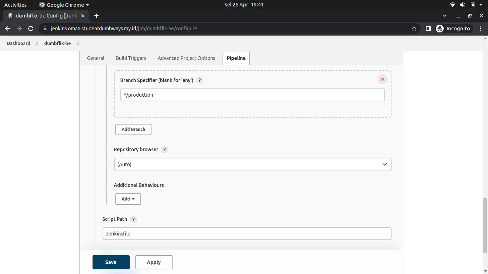 <br>

- Kemudian pilih ```Build Now``` tunggu sampai proses build selesai <br>
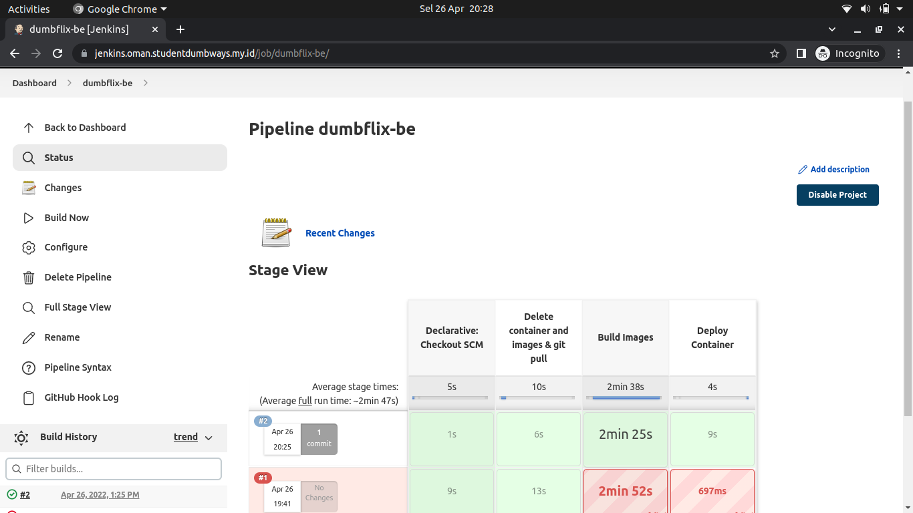 <br>
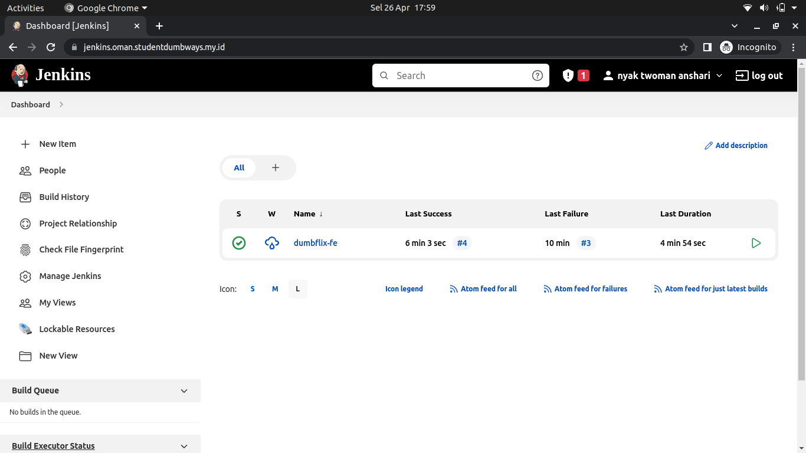 <br>
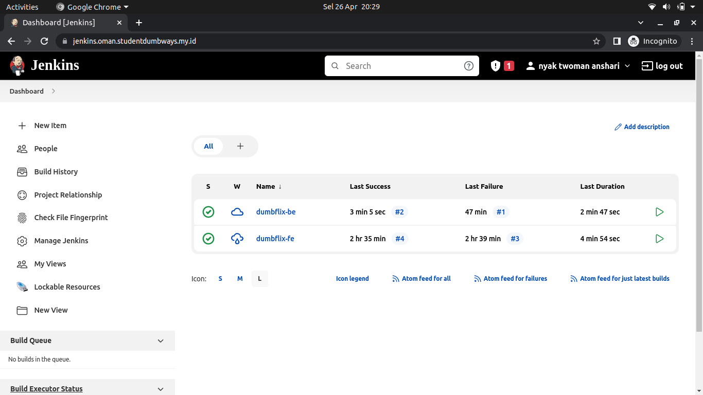 <br>