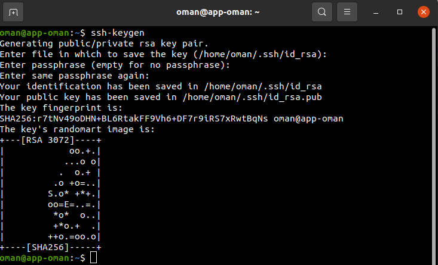
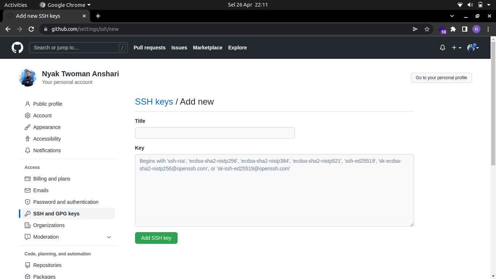

# SSH Key Connect from One Server to Another Server
- Masuk ke salah satu server
- Selanjutnya generate ssh dengan perintah ```ssh-keygen``` <br>


- Kemudian jalankan perintah ```scp -r .ssh oman@103.174.114.26:/home/oman``` masukkan IP semua server agar semua server memiliki ssh key yang sama <br>


# SSH Key for Access the Server without Username & Password
- Masuk ke salah satu server
- masuk ke .ssh ```cd .ssh``` lalu ```cat id_rsa.pub``` copy id_rsa.pub ke ```authorized_keys```
- Coba masuk ke server lain dengan ```ssh oman@116.193.191.236``` maka akan masuk ke server tersebut tanpa perlu memasukkan password <br>


# SSH Key for Access the Git without Username & Password
- Masuk ke menu ```settings``` github kemudian pilih ```SSH and GPG keys```  dan pilih ```New SSH key``` <br>


- Isi pada kolom key dengan id_rsa.pub yang telah di copy dari server dan isi pada kolom title sesuai keinginan dan pilih ```Add SSH key```<br>


- Selanjutnya inisialisai username dan email pada server dengan github
- Jalankan perintah ```git config --global user.name "NyakTwomanAnshari"```
- ```git config --global user.email "omananshari@gmail.com"```
- ```git config --list``` <br>


- Cek apakah sudah terkoneksi dengan git dengan perintah ```ssh -T git@github.com``` <br> 
