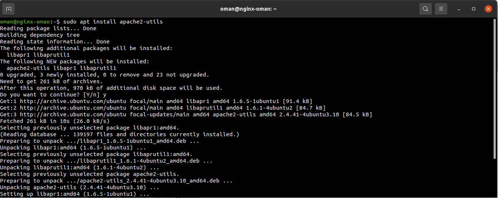
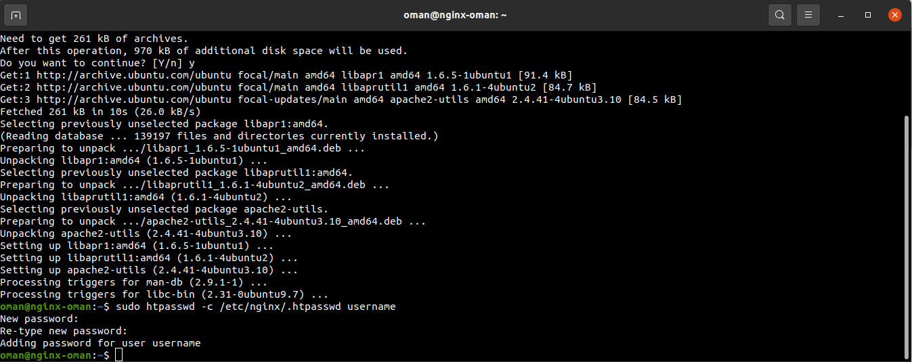
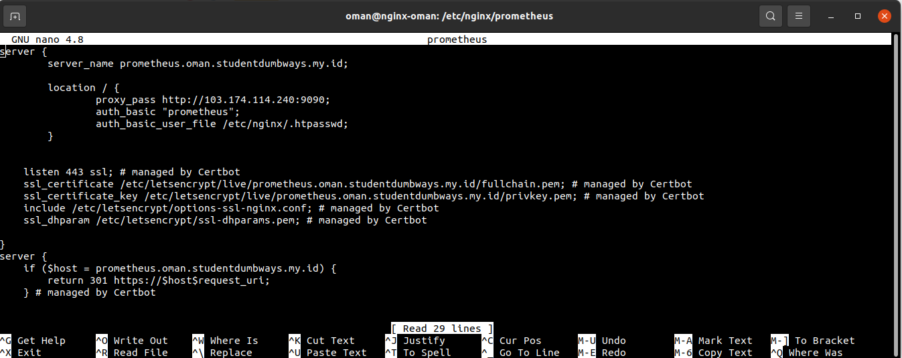
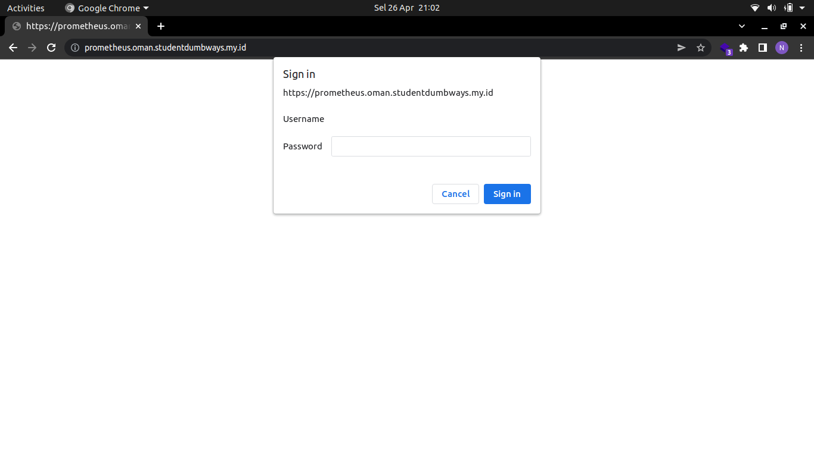

# Auth Prometheus
- Install apache2 utils ```sudo apt install apache2-utils``` <br>


- Generate htpasswd ```sudo htpasswd -c /etc/nginx/.htpasswd oman``` <br>


- Pada konfigurasi reverse proxy pada prometheus, tambahkan ```auth_basic "prometheus";``` dan ```auth_basic_user_file /etc/nginx/.htpasswd;``` <br>


- Jalankan perintah ```sudo nginx -t``` dan ```sudo systemctl reload nginx```
- Akses pada web browser maka akan menampilkan seperti pada gamabr <br>

