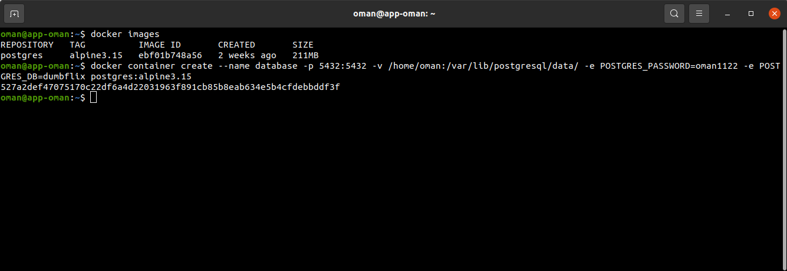
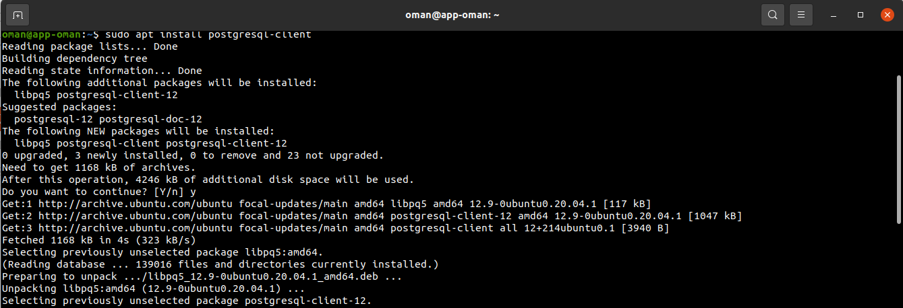
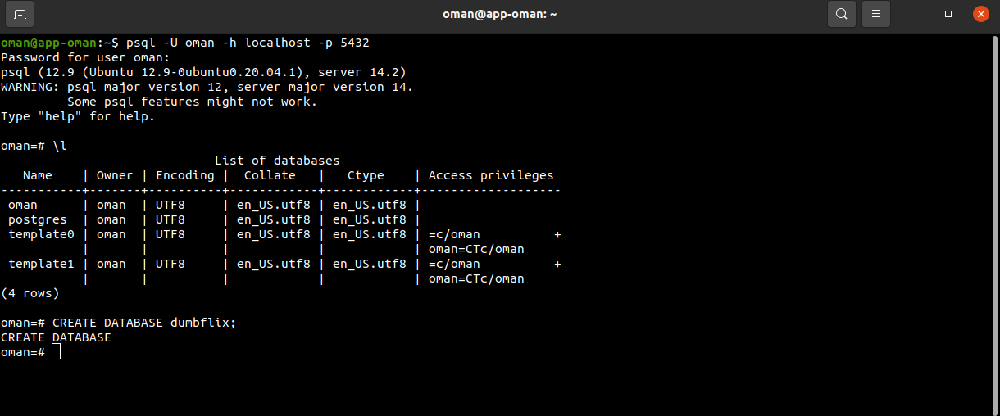

# SETUP DATABASE
- Jalankan perintah ```docker pull postgres:latest``` 
- Kemudian jalankan perintah ```docker container create --name database -p 5432:5432 -v ~/home/oman:/var/lib/postgresql/data -e POSTGRES_PASSWORD-oman1122 -e POSTGRES_DB=dumbflix postgres:latest``` <br>


- Selanjutnya ```sudo apt install postgresql-client``` <br>


- Jalankan perintah ```psql -U oman -h localhost -p 5432``` untuk menjalankan postgresql<br>
