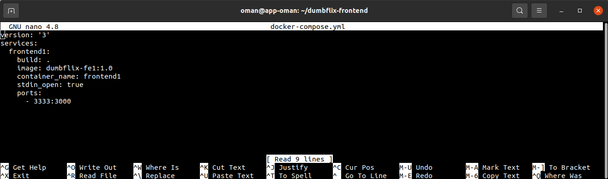

# DEPLOYMENT APLIKASI BACKEND
- Masuk ke directory dumbflix-backend ```cd dumbflix-backend``` selanjutnya buat ```Dockerfile``` dan ```docker-copose.yml``` dengan konfigruasi berikut <br>


- Masuk ke directory config ```cd config``` dan ```sudo nano config.json``` ubah konfigurasi pada config.json sesuai dengan database <br>


- Jalankan perintah ```docker-compose build``` untuk membuat image
- Jalankan perintah ```docker-compose up -d``` untuk membuat container dan menjalankannya
- Cek hasil migrate database ```psql -U oman -d dumbflix -h localhost -p 5432``` <br>


- Masuk ke web browser dan ketik ```https://api.oman.studentdumbways.my.id``` untuk melihat apakah aplikasi backend sudah berjalan <br>


# DEPLOYMENT APLIKASI FRONTEND
- Masuk ke directory dumbflix-frontend ```cd dumbflix-frontend``` selanjutnya buat ```Dockerfile``` dan ```docker-copose.yml``` dengan konfigruasi berikut <br>



- Masuk ke directory src/config ```cd src/config``` lalu edit konfigurasi api.js ```sudo nano api.js``` masukkan url backend<br>


- Kembali ke directory dumbflix-frontend jalankan perintah ```docker-compose build``` untuk membuat image dan ```docker-compose up -d``` untuk membuat container dan menjalankannya

- Masuk ke web browser dan ketik ```https://oman.studentdumbways.my.id``` untuk melihat apakah aplikasi backend sudah berjalan <br>
