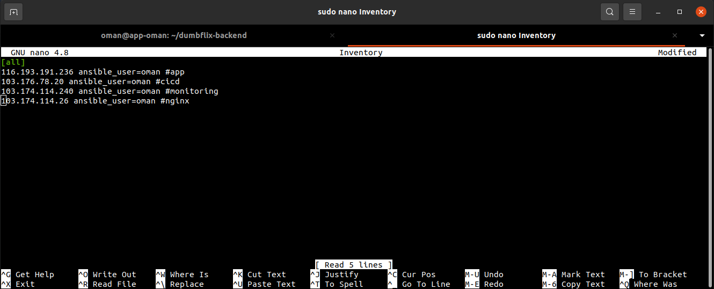

# Setup Node Exporter, Prometheus, and Grafana

## Install Node Exporter
- Pada konfigurasi ```Inventrory``` masukkan semua IP server untuk menginstall node_exporter <br>


- Buat konfigurasi ```sudo nano docker-compose-node_exporter.yml``` dengan konfigurasi berikut <br>


- Buat konfigurasi ansible ```sudo nano node_exporter.yml``` dengan konfigurasi berikut <br>


- Jalankan ```ansible-playbook node_exporter.yml``` tunggu hingga selesai

## Install Prometheus & Grafana
- Buat konfigurasi untuk membaca node_exporter pada file ```prometheus.yml``` <br>


- Buat file ```docker-compose-monitoring.yml``` untuk menginstall prometheus dan grafana <br>


- Buat konfigurasi ansible untuk mendeploy prometheus dan grafana menggunakan docker ```monitoring.yml``` <br>


- Jalankan ```ansible-playbook monitoring.yml``` <br>

- Buka web browser ketik ```https://monitoring.oman.studentdumbways.my.id``` untuk grafana dan prometheus ```https://prometheus.oman.studentdumbway.my.id``` <br>


