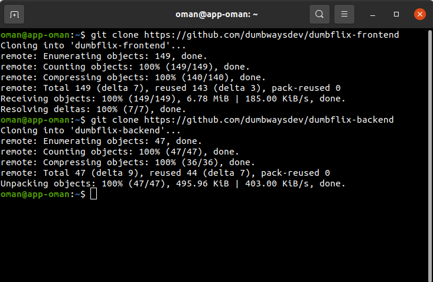
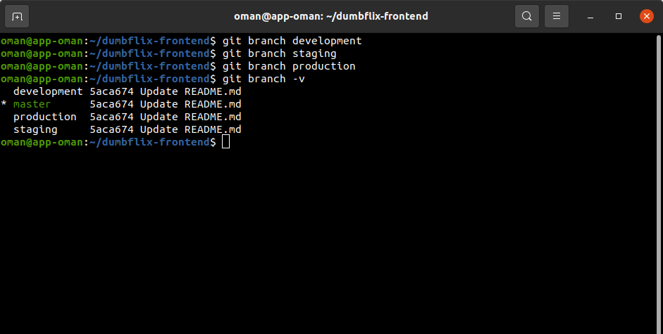
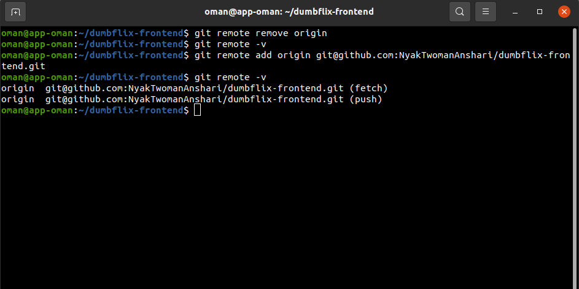

# Setup Repository
- Clone repository ```git clone git@github.com:NyakTwomanAnshari/dumbflix-frontend.git```
- Clone repository ```git clone git@github.com:NyakTwomanAnshari/dumbflix-backend.git``` <br>


- Buat 3 branch production, development, dan staging <br>


- Ubah remote repository <br>
