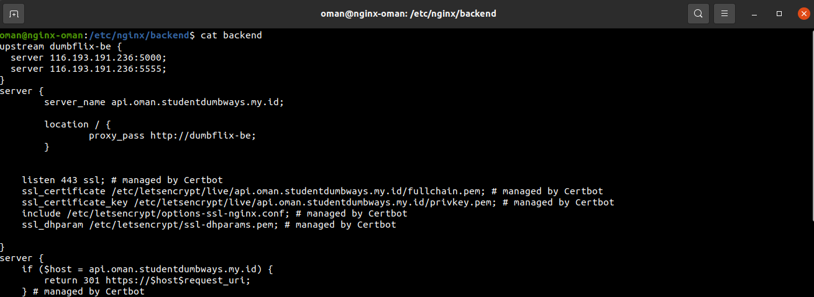

# MEMBUAT SERVER
- Server app & database
- Server nginx
- Server monitoring
- Server CI/CD

## Menginstall docker di semua server
- Buat ```Inventory``` ansible dengan konfigurasi berikut <br>


- Buat ```ansible.cfg``` dengan konfigurasi berikut <br>


- Buat sshkey.pem ```sudo nano sshkey.pem``` dan copy id_rsa dari server ke sshkey.pem <br>


- Konfigurasi ansible meng-install docker dan docker-compose ```docker.yml```<br>


- Jalankan ```ansible-playbook docker.yml```

## Load Balancing
- Masuk ke server nginx
- Buat directory baru untuk menyimpan konfigurasi load balancing ```cd /etc/nginx``` lalu ```mkdir frontend``` dan ```mkdir backend```
- Masuk ke directory frontend ```cd frontend``` buat sebuah file ```sudo nano frontend``` dengan konfigurasi sebagai berikut <br>


- Kembali ke directory /etc/nginx

- Masuk ke directory backend ```cd backend``` buat sebuah file ```sudo nano backend``` dengan konfigurasi sebagai berikut <br>


- Kembali ke directory /etc/nginx jalankan perintah ```sudo nano nginx.conf``` tambahkan folder tadi pada baris include <br>
