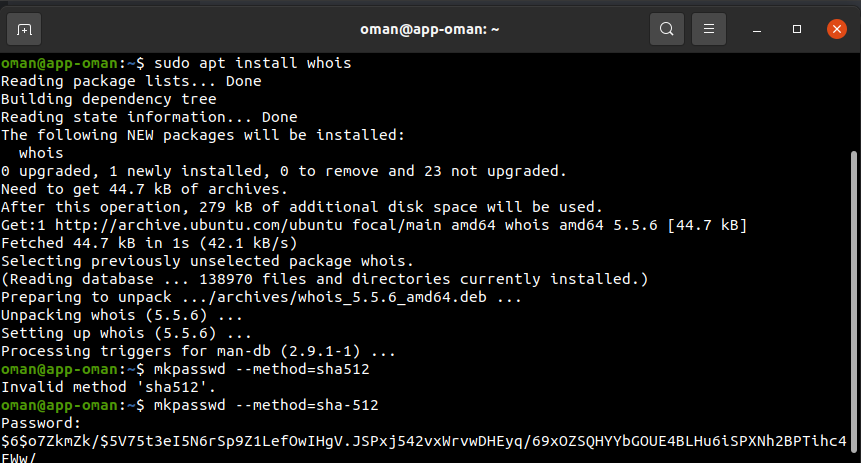

# Membuat user baru pada semua server

- Jalankan perintah ```sudo apt install whois``` lalu jalankan ```mkpasswd --method=sha-512``` untuk mengenerate enkripsi dari password <br>


- Membuat file ansible ```user.yml``` dengan konfigurasi sebagai berikut dan copy generate password yang terenkripsi ke dalam file konfigurasi ansible tersebut<br>


- Jalankan ```ansible-playbook user.yml```