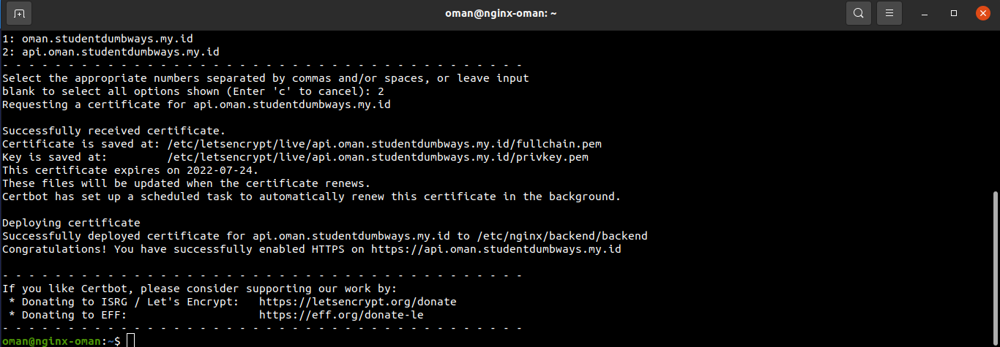
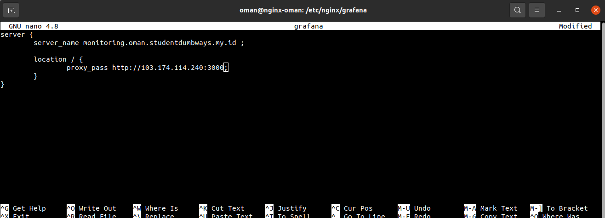

# WEB SERVER NGINX

## Install Nginx
- Jalankan perintah ```sudo apt install nginx -y``` <br>


- Kemudian cek status dari nginx ```sudo systemctl status nginx``` <br>


## Reverse proxy dan load balancing
### Frontend
- Membuat sebuah folder di /etc/nginx ```sudo mkdir frontend``` dan masuk ke directory tersebut ```sudo nano frontend``` dengan konfigurasi sebagai berikut <br>


- Kembali ke directory /etc/nginx masuk ke konfigurasi ```sudo nano nginx.conf``` dan masukkan directory yang telah kita buat konfigurasi <br>


- Install certbot ```sudo snap install core; sudo snap refresh core``` lalu ```sudo snap install --classic certbot```
- Jalankan certbot dan pilih domain yang ingin diberi SSL <br>


### Backend
- Membuat sebuah folder di /etc/nginx ```sudo mkdir backend``` dan masuk ke directory tersebut ```sudo nano frontend``` dengan konfigurasi sebagai berikut <br>


- Kembali ke directory /etc/nginx masuk ke konfigurasi ```sudo nano nginx.conf``` dan masukkan directory yang telah kita buat konfigurasi <br>


- Install certbot ```sudo snap install core; sudo snap refresh core``` lalu ```sudo snap install --classic certbot```
- Jalankan certbot dan pilih domain yang ingin diberi SSL <br>


### CI/CD
- Membuat sebuah folder di /etc/nginx ```sudo mkdir jenkins``` dan masuk ke directory tersebut ```sudo nano jenkins``` dengan konfigurasi sebagai berikut <br>


- Kembali ke directory /etc/nginx masuk ke konfigurasi ```sudo nano nginx.conf``` dan masukkan directory yang telah kita buat konfigurasi <br>


- Install certbot ```sudo snap install core; sudo snap refresh core``` lalu ```sudo snap install --classic certbot```
- Jalankan certbot dan pilih domain yang ingin diberi SSL <br>


### Prometheus
- Membuat sebuah folder di /etc/nginx ```sudo mkdir prometheus``` dan masuk ke directory tersebut ```sudo nano prometheus``` dengan konfigurasi sebagai berikut <br>


- Kembali ke directory /etc/nginx masuk ke konfigurasi ```sudo nano nginx.conf``` dan masukkan directory yang telah kita buat konfigurasi <br>


- Install certbot ```sudo snap install core; sudo snap refresh core``` lalu ```sudo snap install --classic certbot```
- Jalankan certbot dan pilih domain yang ingin diberi SSL <br>


### Grafana
- Membuat sebuah folder di /etc/nginx ```sudo mkdir grafana``` dan masuk ke directory tersebut ```sudo nano grafana``` dengan konfigurasi sebagai berikut <br>


- Kembali ke directory /etc/nginx masuk ke konfigurasi ```sudo nano nginx.conf``` dan masukkan directory yang telah kita buat konfigurasi <br>


- Install certbot ```sudo snap install core; sudo snap refresh core``` lalu ```sudo snap install --classic certbot```
- Jalankan certbot dan pilih domain yang ingin diberi SSL <br>
