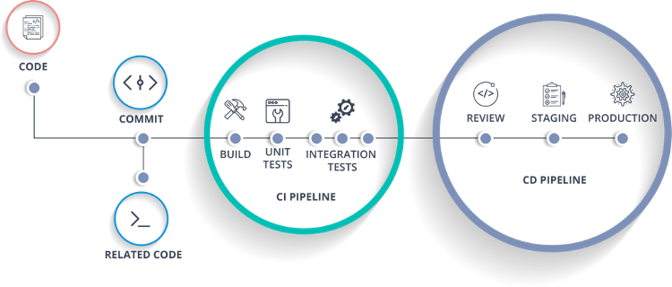
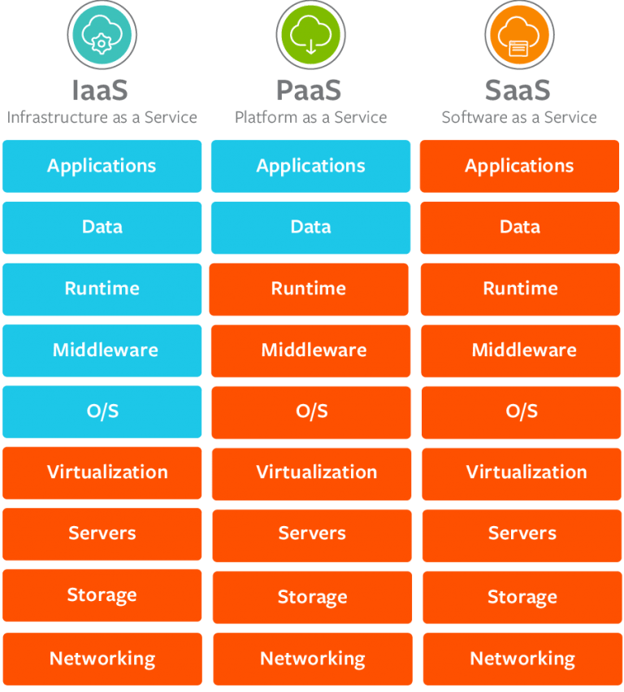
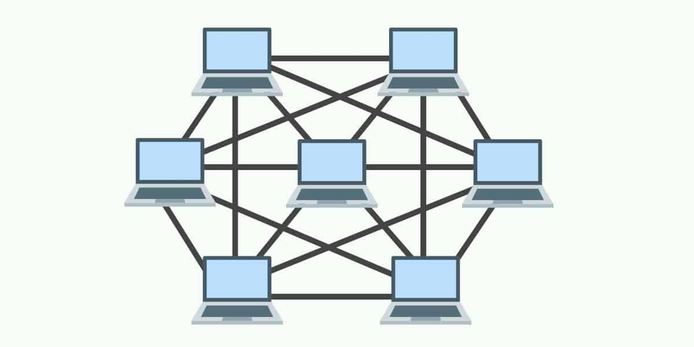
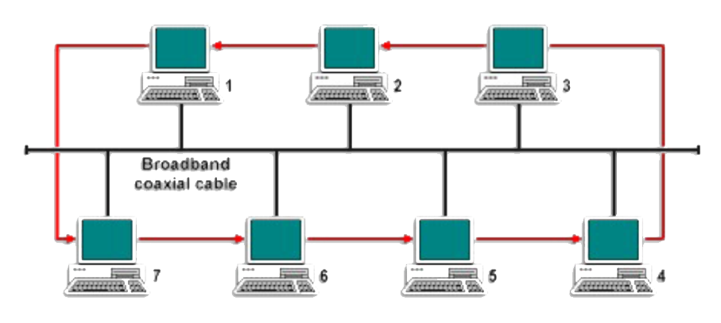
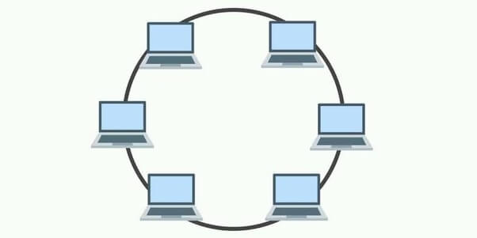
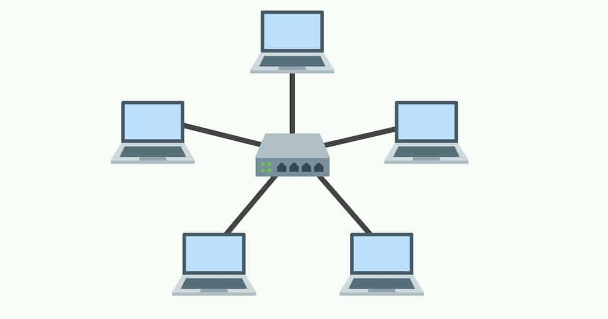
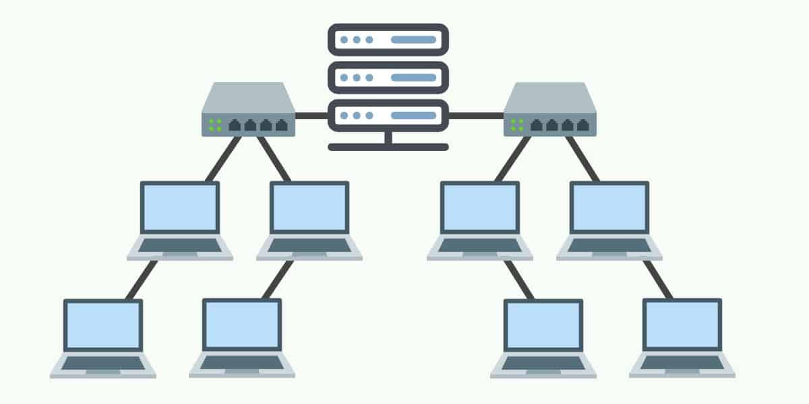

# INTRODUCTION DEVOPS

### DevOps Concept
DevOps adalah seperangkat praktik yang menggabungkan software development (Dev) dan IT Operation (Ops). DevOps membuat semua proses dari software development dan IT Operation berjalan secara otomatis.  
    
### DevOps Workflow
  

#### Plan
Fase ini melibatkan perencanaan untuk seluruh alur kerja yang dibutuhkan sebelum tim pengembang mulai menulis kode. Dalam tahap ini, manajer produk dan manajer proyek akan memainkan peran penting. Mereka akan bekerjasama untuk mengumpulkan requirements dan feedback dari klien ataupun stakeholders. Informasi tersebut kemudian akan dikumpulkan untuk membangun roadmap produk untuk memandu proses pengembangan yang akan dilakukan. 
      
#### Code
Setelah rencana dibuat, tim developer dapat mulai menulis kode yang dibutuhkan untuk mengembangkan produk. Tim developer biasanya akan menggunakan seperangkat plugin standar yang dipasang di lingkungan pengembangan mereka untuk membantu proses pengembangan, membantu menerapkan gaya kode yang konsisten, serta menghindari kelemahan keamanan umum dan anti-pattern.  

#### Build
Setelah tim developer selesai menulis kode yang dibutuhkan, mereka akan memasukan kode tersebut ke dalam shared code repository. Developer akan mengirimkan pull request, setelah developer yang lain akan mereview perubahan yang telah dilakukan. Jika kode tidak memiliki masalah, maka developer tersebut akan menyetujui pull request yang telah dikirim sebelumnya.  
      
#### Test
Langkah selanjutnya adalah melakukan pengujian. Jika ada masalah yang ditemukan pada fase ini, maka masalah tersebut akan dikirim kembali ke tim developer untuk diselesaikan.  
      
#### Release
Fase release menjadi tonggak penting dalam DevOps pipeline. Pada tahap ini, setiap perubahan kode telah melewati serangkaian pengujian dan tim IT operations telah memastikan bahwa masalah yang merusak dan regresi sudah teratasi dengan baik.  
      
#### Deploy
Tahap selanjutnya adalah deployment. Setelah production environment dibuat dan dikonfigurasi maka versi terakhir dari pengembangan yang telah dilakukan akan diterapkan.  
      
#### Monitor
Pada tahap terakhir ini, tim IT operations akan terus bekerja keras untuk memantau infrastruktur, sistem, dan aplikasi. Hal ini dilakukan untuk memastikan bahwa produk atau aplikasi yang dikembangkan dapat berjalan dengan lancar. Mereka juga mengumpulkan data-data penting dari log, analitik, sistem monitoring, serta melihat feedback dari pengguna untuk mengetahui jika ada masalah pada kinerja aplikasi.  
    
### CI/CD Concept
CI/CD adalah suatu metode untuk mengirimkan perubahan kode secara terus menerus hingga aplikasi dapat dirilis ke publik. 
    
- CI / Countinous Integration adalah proses otamatisasi untuk pengembangan saat membuat perubahan pada code. 
- CD / Countinous Deployment adalah proses otomatisasi untuk aplikasi yang siap dirilis ke public. 
          
### Workflow CI/CD
  

#### Keunggulan CI/CD
- Dapat menyebarkan aplikasi sesuai permintaan  
- Dapat menghindari aplikasi tidak berfungsi ketika di deploy  
- Dapat down-grade version aplikasi apabila ada error  
    
### CI/CD Tools
- BitBucket  
BitBucket adalah sebuah layanan hosting yang berbasis web untuk kode sumber dan pembangunan proyek yang menggunakan Mercurial (sejak peluncuran) ataupun sistem Git (sejak Oktober 2011) yang dimiliki oleh Atlassian.  
- Github Action  
Github Action adalah alat untuk mengotomatiskan tindakan rutin dengan repositori dan membantu Anda membuat CI/CD untuk proyek Anda.  
- GitLab  
GitLab adalah sebuah manajer repositori Git berbasis web dengan fitur wiki dan pelacakan masalah, menggunakan lisensi sumber terbuka, dikembangkan oleh GitLab Inc. 
- Jenkins  
Jenkins adalah Server otomatisasi sumber terbuka. Ini membantu mengotomatiskan bagian-bagian pengembangan perangkat lunak yang terkait dengan pembangunan, pengujian, dan penerapan, memfasilitasi integrasi berkelanjutan dan pengiriman berkelanjutan. 

### Operating System Concept
Contoh Operating System:  
- Ubuntu  
- Windows 10  
- MacOS  

#### Contoh dari distribusi linux
- Ubuntu  
- CentOS  
- Debian  
- OpenBSD  
- FreeBSD  
### Virtualization and Container
  
Virtualization adalah menjalankan suatu aplikasi pada suatu operating system di dalam operating system menggunkan aplikasi Hypervisor (Sebuah program untuk membuat dan menjalankan virtual machine) dengan mempengaruhi resource hardware yang digunakan.  
    
### Virtualization Tools
- VMware  
- Virtual Box  
- Microsoft Hyper V  
- Qemu  
- Proxmox  
    
Container adalah Menjalankan suatu aplikasi tanpa menggunakan aplikasi Hypervisor tanpa mempengaruhi resource hardware yang digunakan.  
    
#### Container Tools
- Docker  
- Containerd  
- Podman  
- Linux Container LXC/LXD  
    
### Cloud Computing Concept
Cloud computing adalah sebuah layanan service di internet berupa storage, server, database, dan networking.  
  

- IaaS (Infrastructure as a Service)  
Contoh : AWS (Amazon Web Service), Microsoft Azure, Digital Ocean, dll.  
- PaaS (Platform as a Service)  
Contoh : AWS (Amazon Web Service), Microsoft Azure, Digital Ocean, dll. 
- SaaS (Software as a Service)  
Contoh : Facebook, Twitter, Google Docs  
    
- Private Cloud  
Private cloud adalah layanan yang disediakan untuk sejumlah orang tertentu.  
Contoh: AWS (Amazon Web Service), Microsoft Azure, Digital Ocean, dll.  
- Public Cloud  
Public Cloud adalah layanan yang disedikan untuk publik  
Contoh: Google Drive, Facebook 

# TOPOLOGY AND BASIC NETWORK
Jaringan Komputer adalah hubungan antara 2 komputer atau lebih yang terhubung satu sama lain, koneksi ini sendiri dapat berupa kabel atau non-abel (wireless).  

## Tipe-tipe Jaringan:
- PAN (Personal Area Network) adalah komunikasi antar perangkat yang sangat dekat.  
Contoh: Menghubungkan komputer dengan printer. 

- LAN (Local Area Network) adalah komunikasi antar perangkat yang mencakup area kecil.  
Contoh: Mengakses jaringan E-Learning di Universitas. 

- MAN (Metropolitan Area Network) adalah komunikasi antar perangkat yang mencakup area suatu wilayah provinsi.  
Contoh: Kantor cabang Bank di suatu daerah. 

- WAN (Wide Area Network) adalah komunikasi antar perangkat menggunakan wireless atau menggunakan satelit.  
Contoh: Bank International (Bank Jenius).  

### Jenis-jenis jaringan komputer:
#### Client server network
Client adalah perangkat-perangkat komputer yang menggunakan fasilitas yang disediakan server dalam suatu jaringan.  

Server adalah perangkat komputer yang memberi fasilitas ke perangkat komputer-komputer lain dalam suatu jaringan.  

#### Kelebihan dari jenis jaringan ini adalah:
- Kecepatan akses antar perangkat 
    - Backup data lebih mudah 
    - Keamanan lebih terjaga 
- Kekurangan dari jenis jaringan ini adalah: 
  - Biaya operasional mahal 
  - Diperlukan perangkat komputer khusus untuk menjadi server 
  - Ketergantungan pada perangkat komputer server 

#### Peer to peer network
Peer to peer network adalah seperangkat komputer yang terhubung dalam suatu jaringan yang dapat bertindak sebagai client ataupun server.  
- Kelebihan dari jenis jaringan ini adalah: 
  - Antar komputer dalam suatu jaringan dapat mengakses satu sama lain. 
  - Kelangsungan satu jaringan tidak tergantung pada perangkat komputer server. 
- Kekurangan dari jenis jaringan ini adalah: 
  - Keamanan perangkat komputer tergantung masing-masing user. 
  - Backup dilakukan pada masing-masing perangkat komputer.  

## Network Topology
### Topology Mesh
  
Topologi Mesh adalah penggabungan antar dua topologi yaitu topologi star dan topologi ring. Dimana antar perangkat komputer terhubung secara langsung ke perangkat lainnya yang berada dalam satu jaringan. 

- Karakteristik topologi mesh: 
  - Susunan perangkat komputer yang ada didalam satu jaringan saling terhubung satu sama lain. 
  - Jika jumlah perangkat komputer yang terhubung sangat banyak, akan sangat sulit untuk dikendalikan dibandingkan hanya sedikit perangkat komputer yang terhubung. 

- Kelebihan topologi mesh: 
  - Fault tolerance (apabila ada suatu perangkat yang terganggu atau kerusakan, maka perangkat lain dapat berjalan dengan baik). 
  - Relatif lebih mudah untuk dilakukan troubleshoot. 

- Kekurangan topologi mesh: 
  - Sulitnya untuk melakukan instalasi dan melakukan konfigurasi ulang saat jumlah komputer dan peralatan-peralatan yang terhubung semakin meningkat jumlahnya. 
  - Biaya pemelihara besar dikarenakan perangkat yang banyak. 

### Topology Bus
 
Topologi Bus adalah suatu hubungan antar perangkat komputer yang saling terhubung dengan satu kabel panjang dengan beberapa terminal, dan pada akhir dari kable di akhiri dengan satu terminator. 

- Karakteristik topologi bus: 
  - Node – node dihubungkan secara serial sepanjang kabel, dan pada kedua ujung kabel ditutup dengan terminator. 
  - Sangat sederhana dalam instalasi. 
  - Sangat ekonomis dalam biaya. 
  - Paket-paket data saling bersimpangan pada suatu kabel. 
  - Problem yang sering terjadi adalah jika salah satu node rusak, maka jaringan keseluruhan dapat down, sehingga seluruh node tidak bisa berkomunikasi dalam jaringan tersebut. 
  
- Kelebihan topologi bus: 
  - Tidak memerlukan sumber daya kabel yang banyak. 
  - Biayanya juga lebih murah dibanding dengan topologi lainnya. 
  - Tidak terlalu rumit jika kita ingin menambah jangkauan jaringan. 
  - Sangat sederhana. 
  
- Kekurangan topologi bus: 
  - Tidak cocok untuk lalu lintas jaringan yang padat. 
  - Setiap barrel connector yang digunakan sebagai penghubung memperlemah sinyal elektrik yang dikirimkan, dan kebanyakan akan menghalangi sinyal untuk dapat diterima dengan benar. 
  - Sangat sulit untuk melakukan troubleshoot pada bus. 
  - Lebih lambat dibandingkan dengan topologi yang lain. 
     
### Topologi Ring
  
Topologi Ring adalah suatu hubungan antar perangkat komputer yang masing-masing titik/node berfungsi sebagai repeater yang akan memperkuat sinyal disepanjang sirkulasinya, artinya masing-masing perangkat saling bekerjasama untuk menerima sinyal dari perangkat sebelumnya kemudian meneruskannya pada perangkat sesudahnya, proses menerima dan meneruskan sinyal data ini dibantu oleh token. 

- Karakteristik topologi ring: 
  - Node-node dihubungkan secara serial di sepanjang kabel, dengan bentuk jaringan seperti lingkaran. 
  - Sangat sederhana dalam layout seperti jenis topologi bus. 
  - Paket-paket data dapat mengalir dalam satu arah (searah jarum jam) sehingga collision (tabrakan antar paket data) dapat dihindarkan. 
  - Problem yang dihadapi sama dengan topologi bus, yaitu: jika salah satu node rusak maka seluruh node tidak bisa berkomunikasi dalam jaringan tersebut. 
 
- Kelebihan topologi ring: 
  - Data mengalir dalam satu arah sehingga terjadinya collision dapat dihindarkan. 
  - Aliran data mengalir lebih cepat karena dapat melayani data dari kiri atau kanan dari server. 
  - Dapat melayani aliran lalulintas data yang padat, karena data dapat bergerak kekiri atau kekanan. 
  - Waktu untuk mengakses data lebih optimal. 

- Kekurangan topologi ring: 
  - Apabila ada satu komputer dalam ring yang gagal berfungsi, maka akan mempengaruhi keseluruhan jaringan. 
  - Menambah atau mengurangi komputer akan mengacaukan jaringan. 
  - Sulit untuk melakukan konfigurasi ulang. 

### Topologi Star
  
Topologi Star adalah suatu metode atau cara untuk menghubungkan dua atau lebih komputer dengan jaringan yang berbentuk bintang (star), dimana topologi jaringan berupa kovergensi dari node tengah ke setiap node pengguna, sehingga semua node atau titik terkoneksi dengan node tengah tersebut. 

- Karakteristik topologi star: 
  - Setiap node berkomunikasi langsung dengan konsentrator (HUB). 
  - Bila setiap paket data yang masuk ke consentrator (HUB) kemudian di broadcast keseluruh node yang terhubung sangat banyak (misalnya memakai hub 32 port), maka kinerja jaringan akan semakin turun. 
  - Sangat mudah dikembangka. 
  - Jika salah satu ethernet card rusak, atau salah satu kabel pada terminal putus, maka keseluruhhan jaringan masih tetap bisa berkomunikasi atau tidak terjadi down pada jaringan keseluruhan tersebut. 

- Kelebihan topologi star:
  - Cukup mudah untuk mengubah dan menambah komputer ke dalam jaringan yang menggunakan topologi star tanpa mengganggu aktvitas jaringan yang sedang berlangsung.  
  - Apabila satu komputer yang mengalami kerusakan dalam jaringan maka komputer tersebut tidak akan membuat mati seluruh jaringan star. 
  - Kita dapat menggunakan beberapa tipe kabel di dalam jaringan yang sama dengan hub yang dapat mengakomodasi tipe kabel yang berbeda. 
 
- Kekurangan topologi star: 
  - Memiliki satu titik kesalahan, terletak pada hub.Jika hub pusat mengalami kegagalan, maka seluruh jaringan akan gagal untuk beroperasi. 
  - Membutuhkan lebih banyak kabel karena semua kabel jaringan harus ditarik ke satu central point, jadi lebih banyak membutuhkan lebih banyak kabel daripada topologi jaringan yang lain. 
  - Jumlah terminal terbatas, tergantung dari port yang ada pada hub. 
  - Lalulintas data yang padat dapat menyebabkan jaringan bekerja lebih lambat.  

### Topologi Tree
  
Topologi Tree adalah gabungan dari beberapa topologi star yang dihubungan dengan topologi bus, jadi setiap topologi star akan terhubung ke topologi star lainnya menggunakan topologi bus, biasanya dalam topologi ini terdapat beberapa tingkatan jaringan, dan jaringan yang berada pada tingkat yang lebih tinggi dapat mengontrol jaringan yang berada pada tingkat yang lebih rendah.  

- Karakteristik topologi tree:  
  - Jaringan yang berada pada tingkat yang lebih tinggi dapat mengontrol jaringan yang berada pada tingkat yang lebih rendah.  

- Kelebihan topologi tree:  
  - Mudah menemukan suatu kesalahan dan juga mudah melakukan perubahan jaringan jika diperlukan.  
  
- Kekurangan topologi tree:  
  - Menggunakan banyak kabel, sering terjadi tabrakan dat dan lambat, jika terjadi kesalahan pada jaringan tingkat tinggi, maka jaringan tingkat rendah akan terganggu juga.  

## IP Address
### IPv4 
IPv4 atau singkatan dari Internet Protocol Version 4 merupakan sebuah protokol untuk penggunaan paket penggantian Link Layer Networks seperti ethernet. IPv4 menawarkan alamat yang banyaknya diperkirakan hingga 4,3 milyar karena IPv4 hanya memiliki 32 bit.
  
### IPv6 
IPv6 atau singkatan dari Internet Protocol Version 6 merupakan sebuah protokol yang lebih mutahir dan fitur yang lebih bagus dibanding IPv4. Ia memiliki mkemampuan untuk memberikan angka alamat yang jumlahnya tidak terbatas karena IPv6 memiliki 128 bit. IPv6 menggantikan IPv4 dalam rangka untuk mengakomodir pertumbuhan angka dari jaringan di seluruh dunia dan membantu menyelesaikan masalah alamat IP yang kelelahan.  

Salah satu perbedaan antara IPv4 dan IPv6 adalah penampilah dari alamat IP. IPv4 mrnggunakan empat 1 byte angka decimal, yang dipisahkan dengan titik (contohnya 192.168.1.1), sedangkan IPv6 menggunakan angka hexadesimal yang dipisahkan dengan titik dua ( contoh: fe80::d4a8:6435:d2d8:d9f3b11).  

### IP Publik
- Digunakan untuk komunikasi di luar jaringan lokal (internet). 
- Ditetapkan ISP (Internet Service Protocol) anda. 
- Teridentifikasi di internet. 
- Unik secara global. 
  
### IP Private
- Dirancang untuk komunikasi dalam jaringan lokal. 
- Ditetapkan administrator jaringan atau perangkat anda. 
- Tidak teridentifikasi di internet. 
- Unik hanya dalam jaringan lokal. 

### IP Statis
- Ditetapkan ISP anda. 
- IP tidak berubah. 
- IP berbayar. 
- Biasa digunakan untuk bisnis. 

### IP Dinamis
- Ditetapkan oleh DHCP (Dynamic Host Configuration Protocol) server. 
- IP dapat berubah-ubah. 
- IP gratis. 
- Biasa digunakan untuk rumah atau kantor. 

### OSI Concept
  
- Physical adalah layer mentransmisikan data dalam bentuk bit stream. contoh perangkat nya seperti wireless, fiber optik, dll. 
- Data Link adalah layer penyalur informasi antar jaringan. 
- Network adalah layer yang menentukan jalur terbaik melalui jaringan (IP Address). 
- Transport adalah layer yang mendukung komunikasi antara beragam perangkat di berbagai jaringan seperti TCP/UDP. 
- Session adalah layer pembuka jaringan dalam durasi waktu yang cukup agar pertukaran data berjalan dengan baik. 
- Presentation adalah layer penerjemah bahasa komunikasi yang berbeda antara dua perangkat komputer. Melakukan enkripsi data dari perangkat sumber, lalu men-dekripsi-nya pada perangkat penerima. 
- Application adalah layer pusat terjadinya interaksi antar pengguna.  

### TCP/IP Concept
  
TCP/IP (Transmission Control Protocol/Internet Protocol) adalah standar komunikasi data yang digunakan oleh komunitas internet dalam proses tukar-menukar data dari satu komputer ke komputer lain di dalam jaringan Internet.  

- Physical Layer  
Physical layer mendefinisikan karakteristik yang dibutuhkan hardware untuk membawa sinyal data transmisi. Hal seperti level tegangan, nomor dan lokasi pin interface, didefinisikan pada layer ini.

- Network Access Layer  
Network Access Layer merupakan gabungan antara Network, Data Link dan Physical layer. Pada Network Access Layer tersimpan TCP/IP, dan protokol yang lebih umum dikenal (IP, TCP, UDP, dll) untuk digunakan sebagai protokol-level yang lebih tinggi.
Fungsi dalam layer ini adalah mengubah IP datagram ke frame yang ditransmisikan oleh network, dan memetakan IP Address ke physical address yang digunakan dalam jaringan. IP Address ini harus diubah ke alamat apapun yang diperlukan untuk physical layer untuk mentransmisikan data.

- Internet Layer  
Internet Layer terdapat Internet Protocol yang merupakan jantung dari TCP/IP dan protokol paling penting pada Internet Layer (RFC 791). IP menyediakan layanan pengiriman paket dasar pada jaringan tempat TCP/IP network dibangun. Seluruh protokol, diatas dan dibawah Internet layer, menggunakan Internet Protokol untuk mengirimkan data. Semua data TCP/IP mengalir melalui IP, baik incoming maupun outgoing, dengan mengabaikan tujuan terakhirnya.

- Transport Layer  
Transport Layer terdapat dua protokol utama pada layer ini yaitu Transmission Control Protocol (TCP) dan User Datagram Protocol (UDP). TCP menyediakan layanan pengiriman data handal dengan end-to-end deteksi dan koreksi kesalahan. UDP menyediakan layanan pengiriman datagram tanpa koneksi (connectionless) dan low-overhead. Kedua protokol ini mengirmkan data diantara Application Layer dan Internet Layer. Programmer untuk aplikasi dapat memilih layanan mana yang lebih dibutuhkan untuk aplikasi mereka.

- Application Layer  
Application Layer. Layer ini termasuk seluruh proses yang menggunakan transport layer untuk mengirimkan data.