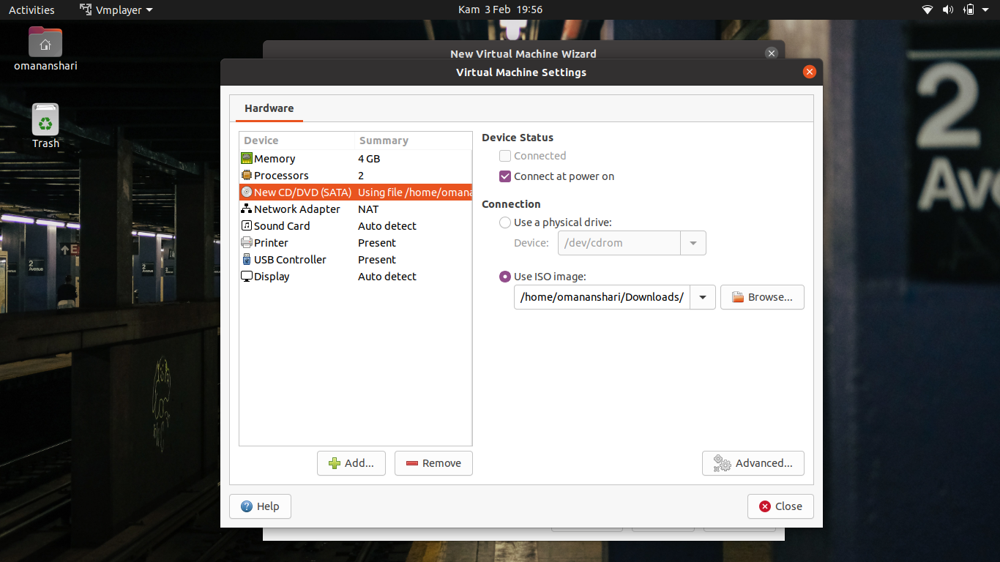
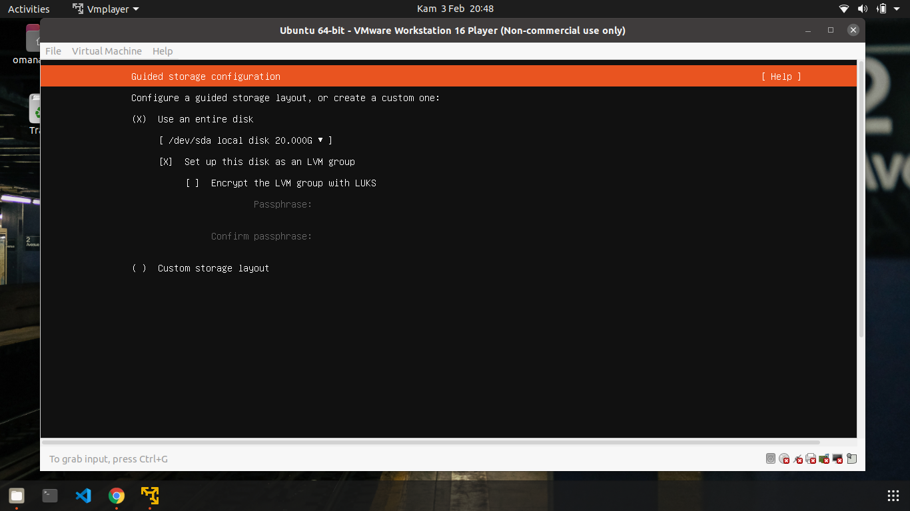

# INSTALATION UBUNTU SERVER AND BASIC SHELL SCRIPTING
## Instalation Ubuntu Server and VMware
### Instalation VMware
- Langkah pertama download VMware pada link ```https://www.vmware.com/products/workstation-player.html```
- Kemudian, masuk ke directory yang ada file VMware yang sudah terdownload
- Jika sudah di directory tersebut, maka buka terminal pada directory tersebut
- Lalu masukkan perintah ```sudo sh VMware-Player-Full-16.2.1-18811642.x86_64.bundle``` untuk melakukan instalasi <br>
 <br>
- Apabila proses instalasi selesai maka VMware siap digunakan.
  
### Instalation Ubuntu Server
Langkah-langkah menginstall: <br>
- Buka VMware yang sudah di install <br>
 <br>
- Download ISO Ubuntu Server terlebih dahulu pada link ```https://ubuntu.com/download/server``` pilih yang manual server installation
- Apabila sudah terdownload maka masuk ke VMware lalu pilih ```create a new virtual machine```
- Jika sudah maka pilih ```Use ISO image``` lalu masukkan ISO yang telah terdownload tadi <br>
 <br>
- Lalu pilih operating system yang akan di install <br>
 <br>
- Kemudian pilih directory mana yang ingin menyimpan instalasi ubuntu server tersebut <br>
 <br>
- Selanjutnya masukkan disk size yang di inginkan, recomended dari VMware 20GB <br>
 <br>
- Jika sudah, maka pilih customize hardware sesuai kebutuhan <br>
 <br>
 <br>
 <br>
 <br>
- Apabila semua step diatas sudah selesai maka pilih ```close``` dan ```finish```
- Selanjutnya masuk ke Virtual Machine yang sudha selesai dibuat lalu pilih ```power on``` <br>
 <br>
- Tunggu hingga sampai muncul pilihan bahasa, pastikan memilih seperti step dibawah <br>
 <br>
 <br>
 <br>
 <br>
- Jika sudah masuk ke tahapan Network Connections, pilih ```IPv4 Method Manual (DHCP)``` <br>
 <br>
- Apabila sudah selesai pilih save dan lanjut ke tahap selanjutnya <br>
 <br>
 <br>
 <br>
 <br>
 <br>
 <br>
- Kemudian jangan lupa pilih ```install OpenSSH server``` <br>
 <br>
- Jika sudah tunggu sampai instalasi selesai <br>
 <br>
- Apabila sudah selesai instalasi maka pilih ```reboot now```
- Kemudian masuk ke ubuntu server yang sudah selesai terinstall dengan memasukkan username dan password <br>
 <br>
- Selanjutnya ketik perintah ```ping google.com``` untuk mencoba terhubung ke internet atau tidak
- Jika ada notice ```ping google.com: temporary failure in name resolution``` berarti gagal terhubung ke internet <br>
 <br>
- Untuk itu perlu mengganti IP Address
- Ketik perintah ```cd /etc``` kemudian ```cd /netplan``` lalu masuk ke file ```sudo nano 00-installer-config.yaml``` <br>

- Kemudian ganti IP pada file tersebut dengan IP pada komputer yang digunakan
- Untuk melihat IP Address pada komputer dengan cara mengetik perintah ```ifconfig``` <br>
 <br>
- Selanjutnya masukkan IP Address sesuai dengan IP pada komputer dengan mengganti gateway 255 menjadi 1
- Apabila sudah IP sudah terganti maka ketik perintah ```netplan apply``` untuk mengkonfirmasi IP yang telah diubah tadi
- Lalu tes apakah sudah terhubung ke internet dengan mengetik perintah ```ping google.com``` jika berhasil maka akan menghasilkan outpu seperti dibawah <br>
 <br>
- Sekarang coba masuk menggunakan SSH lewat terminal pada operating system linux dengan mengetik perintah ```ssh oman@192.168.100.5``` <br>
 <br>
- Untuk keluar dari linux server menggunakan perintah ```logout``` <br>
 <br>