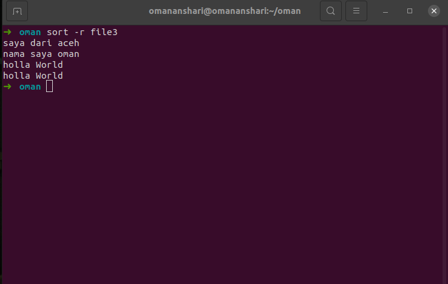

# MANAGE SERVER WITH TERMINAL
## Terminal
Terminal adalah sebuah command prompt dimana kita bisa mengontrol suatu file, membuat folder, membuat dan mengbubah akses atau membaca dan sebagainya banyak yang dapat dilakukan pada terminal.

## BASH (Bourne Again Shell)
BASH adalah suatu bahasa yang berjalan pada linux/unix dan mempunyai fungsi sebagai penerjemah antara sistem dan sistem operasi.

## Text Editor Nano
Text Editor adalah sebuah aplikasi yang berjalan di atas terminal, yang berguna untuk memanipulasi data pada suatu file. Secara default sudah ada pada sistem operasi linux. <br>
Untuk memeriksa nya dapat menggunakan perintah ```nano --version``` <br>
 <br>
- Membuka file dengan text editor nano dengan perintah ```nano oman``` <br>
 <br>

### Shortcut Text Editor Nano
- ```ctrl+x``` perintah tersebut digunakan untuk menyimpan file dan keluar dari text editor nano
- ```ctrl+O``` perintah tersebut digunakan untuk menyimpan file tetapi tidak menutup text editor nano <br>
 <br>
 <br>
- ```ctrl+w``` perintah tersebut digunakan untuk mencari teks, contoh: mencari teks ```Hello World``` maka secara otomatis kursor akan berpindah pada line dengan kata Hello World
<br>
- ```alt+a``` Perintah tersebut digunakan untuk memilih teks dengan cursor <br>
<br>
- ```alt+6``` Perintah tersebut digunakan untuk mengcopy teks yang sudah dipilih <br>
- ```ctrl+u``` Perintah tersebut digunakan untuk melakukan paste teks yang sudah dipilih <br>
<br>
- ```ctrl+k``` Perintah tersebut digunakan untuk melakukan cut pada teks yang telah dipilih <br>
<br>
- ```ctrl+a``` Perintah tersebut digunakan untuk kembali ke awal baris dari teks <br>
<br>
- ```ctrl+e``` Perintah tersebut digunakan untuk kembali ke akhir baris dari teks <br>
<br>

### Text Manipulation
- ```cat``` Perintah yang dapat digunakan untuk melihat isi dari suatu file tanpa harus membuka text editor ```nano``` serta juga dapat mengubah isi file pada output <br>
Contoh: <br>
  - ```cat oman```
  <br>
  - ```cat > file.baru``` Peintah yang digunakan untuk membuat file baru dan memasukkan teks <br>
  <br>
  - ```cat file1 file2 > file3``` Perintah yang digunakan untuk menggabungkan dua file serta menyimpan pada yang ketiga <br>
  <br>
  <br>
- ```sed``` atau stream editor adalah Perintah yang dapat melakukan manipulasi teks dasar pada file dengan cepat <br>
Contoh: <br>
  - ```sed -i 's/hello/holla/g' file3``` Perintah tersebut digunakan untuk mengganti kata ```hello``` menjadi ```holla``` pada file3 <br>
  <br>
- ```grep``` Perintah yang digunakan untuk mencari sebuah teks dalam file yang sudah dibuat <br>
Contoh: <br>
  - ```grep aceh file3``` Perintah tersebut secara otomatis akan mencari kata ```aceh``` pada file3 <br>
  <br>
  - ```grep -c aceh file3``` Perintah tersebut digunakan untuk menghitung berapa banyak kata ```aceh``` pada file3 <br>
  <br>
  - ```grep oman *``` Perintah tersebut digunakan untuk mencari kata ```oman``` pada semua file dalam directory
  <br>
- ```sort``` Perintah untuk mengurutkan data secara ascending maupun descending <br>
Contoh: <br>
  - ```sort file3``` Perintah untuk mengurutkan dari yang terkecil hingga terbesar <br>
  <br>
  - ```sort -r file3``` Perintah untuk mengurutkan dari yang terbesar hingga yang terkecil <br>
  <br>
- ```echo``` Perintah untuk mencetak string pada terminal <br>
Contoh: <br>
  - ```echo "hello world"``` Perintah untuk mencetak pesan ```hello world``` pada terminal <bt>
  <br>
  - ```echo "hello oman" >> file3``` Perintah untuk menambahkan teks pada file yang ditentukan <br>
  <br>
  - ```echo "terima kasih" > file3``` Perintah untuk me-replace semua teks yang ada pada file3 dan digantikan dengan kata ```terima kasih```<br>
  <br>

## Monitoring
Monitoring adalah aktivitas mengamati performance sistem secara real time <br>
- ```htop``` Perintah untuk memonitoring sistem dari komputer berupa CPU, Memory, jumlah core yang digunakan, syntax yang dijalankan dan lain sebagainya. <br>
  - ```sudo apt install htop -y``` Perintah untuk menginstall <br>
   <br>
  - ```htop``` Perintah untuk membuka aplikasi htop <br>
   <br>
- ```lsof``` atau list open file adalah Perintah untuk melihat seluruh isi file yang aktif yang sedang berjalan pada sistem <br>
 <br>
  - ```lsof -u omananshari``` Perintah untuk menampilkan proses yang dilakukan oleh user ```omananshari``` <br>
   <br>
  - ```lsof -i :80``` Perintah untuk menampilkan proses yang berjalan yang menggunakan port:80 <br>
   <br>
- ```ps``` Perintah untuk mengetahui proses yang sedang berjalan pada sistem <br>
Contoh: <br>
  - ```ps -f -u omananshari```  Perintah untuk menampilkan proses pada user ```omananshari``` <br>
  <br>
  - ```ps -aux``` Perintah untuk menampilkan semua proses secara lengkap <br>
  <br>

## Network Firewall
Network Firewall adalah perintah untuk mengamankan sebuah server. Tools yang biasa digunakan adalah ```iptables``` dana ```ufw``` <br>
- iptables adalah sebuah tools di linux yang digunakan untuk memberi dukungan langsung terhadap keamanan sistem serta beberapa keperluan jaringan. Iptables juga bisa digunakan untuk melakukan seleksi terhadap paket yang datang seperti output dan input berdasarkan IP, port, dan sebagainya. <br>
- uncomplicated firewall (UFW) adalah sebuah fitur front-end iptables pada linux untuk melakukan konfigurasi firewall. <br>
  - ```sudo apt install ufw -y``` Perintah untuk menginstall ufw <br>
   <br>
  - ```sudo ufw default deny incoming``` Perintah yang digunakan untuk memblokir akses yang masuk <br>
   <br>
  - ```sudo ufw default allow outgoing``` Perintah untuk membuka semua akses keluar <br>
   <br>
  - ```sudo ufw app list``` Perintah untuk menampilkan aplikasi yang di dukung oleh ufw pada server <br>
   <br>
  - ```sudo ufw allow "nginx full"``` Perintah untuk mengizinkan akses dari luar ke dalam aplikasi nginx <br>
   <br>
  - ```sudo ufw allow 30``` Perintah untuk membuka akses untuk port 30 <br>
   <br>
  - ```sudo ufw allow 30/tcp``` Perintah untuk membuka akses untuk port 30 dengan koneksi tcp <br>
   <br>
  - ```sudo ufw allow 30/udp``` Perintah untuk membuka akses untuk port 30 dengan koneksi udp <br>
   <br>
  - ```sudo ufw deny 40``` Perintah untuk memblokir semua akses ke port 40 <br>
   <br>
  - ```sudo ufw delete deny 40``` Perintah untuk menghapus konfigurasi pada port 40 <br>
   <br>
  - ```sudo ufw verbose``` Perintah untuk melihat status dari ufw
   <br>

## System Performance
System performance digunakan untuk memantau server. <br>
### Beberapa tools yang digunakan:
- vmstat <br>
  vmstat adalah tools yang digunakan untuk menampilkan penggunaan memory, swap memory, memberi informasi proses sistem, interrupt system, kecepatan I/O dan statistik CPU Secara real time. <br>
  - ```sudo apt install sysstat -y``` Perintah untuk menginstall vmstat <br>
   <br>
  - ```vmstat``` Perintah untuk menjalankan ```vmstat``` <br>
   <br>
  - ```vmstat -sSM``` Perintah untuk mempermudah membaca status dari sistem <br>
   <br>
  - ```vmsat 2 4``` Perintah untuk menampilkan data status dalam waktu 2 detik sebanyak 4 kali <br>
   <br> 
- iostat
  iostat adalah tools untuk memantau input atau output sistem, melihat berapa lama perangkat yang aktif dan kecepatan I/O. Secara default iostat sudah ada apabila sudah menginstall vmstat <br>
   <br> 
- nmon
  nmon adalah tools untuk memonitoring dengan data yang lebih lengkap. <br>
  - ```sudo apt install nmon -y``` Perintah untuk menginstall nmon <br>
   <br>
  - ```nmon``` Perintah untuk menjalankan nmon <br>
   <br>