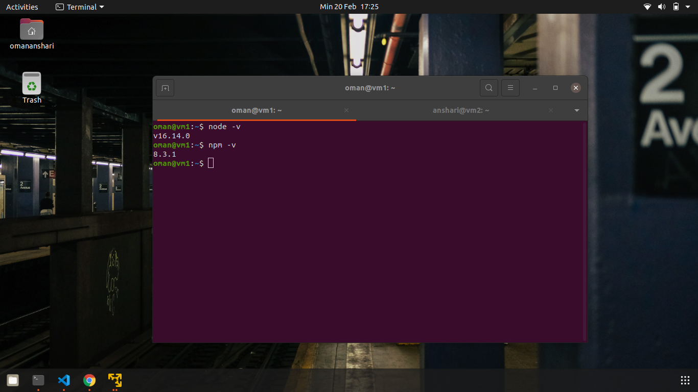

# APPLICATION AND LINUX
Aplikasi adalah sebuah perangkat lunak komputer yang melakukan fungsi spesifik untuk pengguna akhir. Aplikasi dapat berjalan secara mandiri atau bersamaan dengan sekelompok program. Untuk menjalankan aplikasi tertentu membutuhkan application runtime. <br>
Application Runtime adalah perangkat lunak yang dirancang untuk mendukung untuk menjalankan program komputer yang ditulis dalam bahasa komputer. <br>
Berikut adalah contoh dari application runtime: <br>
- Menjalankan aplikasi yang dibuat dengan bahasa pemrograman javascript (node.js) maka perlu meng-install node.js.
- Menjalankan aplikasi yang dibuat dengan bahasa pemrograman python maka perlu meng-install python.
- Menjalankan aplikasi yang dibuat dengan bahasa pemrograman golang maka perlu meng-install golang.
## Installation Application and Make a Simple App
### Node.js
#### Langkah-langkah untuk menginstall node.js:
- Download dengan menggunakan perintah ```wget -qO- https://raw.githubusercontent.com/nvm-sh/nvm/v0.39.1/install.sh | bash``` <br>
 <br>
- Kemudian jalankan perintah ```nvm install 14``` untuk menginstall nvm (Node Version Manager) dengan versi 14. Apabila muncul notice ```command 'nvm' not found``` maka jalankan perintah ```source ~/.profile``` <br>
 <br>
- Untuk mengecek versi dari nvm (Node Version Manager) dan npm (Node Package Manager) dengan perintah ```node -v``` dan ```npm -v ``` apabila belum terdeteksi ketik perintah ```exec bash```<br>
 <br>
- Untuk menggunakan versi lain dari nvm dan npm bisa dengan menjalankan perintah ```nvm install 16```
- Selanjutnya mengganti versi dengan menjalankan perintah ```nvm use 16``` <br>
 <br>
 <br>

#### Langkah-langkah membuat aplikasi sederhana node.js:
- Buat directory baru dengan perintah ```mkdir myapp-node.js```
- Selanjutnya pindah ke directory ```myapp-node.js``` kemudian jalankan perintah ```npm init -y``` untuk menginisialisasi aplikasi node.js <br>
 <br>
- Kemudian install express dengan perintah ```npm install express --save``` <br>
 <br>
- Apabila sudah selesai, buat file index.js dengan perintah ```nano index.js``` dan tuliskan code program untuk menampilkan ```Hello World``` <br>
 <br>
- Lalu simpan dengan shortcut ```ctrl+x``` ketik ```y``` dan tekan ```enter```
- Selanjutnya jalankan dengan perintah ```node index.js``` <br>
 <br>
- Kemudian buka web browser dengan megetik ```localhost:3000``` <br>
 <br>

### Python
#### Langkah-langkah untuk menginstall python3:
- Terlebih dahulu ketik perintah pada terminal ```sudo apt update; sudo apt upgrade```
- Kemudian ketik perintah ```python3 -V``` secara default python3 telah terinstall pada ubuntu. <br>
 <br>
- Selanjutnya ketik perintah ```sudo apt install python3-pip``` untuk menginstall package manager dari python3 <br>
 <br>
- Lalu ketik perintah ```pip install flask``` untuk menginstall flask. Dimana flash adalah web framewrok dari python. <br>
 <br>

#### Langkah-langkah membuat aplikasi sederhana python3:
- Buat suatu directory baru dengan perintah ```mkdir myapp-python```
- Lalu pindah ke directory ```myapp-python``` <br>
 <br>
- Selanjutnya buat file index.py dengan perintah ```sudo nano index.py``` dan tuliskan code program untuk menampilkan ```Hello World``` <br>
 <br>
- Kemudian buka web browser dengan megetik ```localhost:5000``` <br>
 <br>

### Go atau golang
#### Langkah-langkah untuk menginstall golang:
- Download dengan perintah ```wget https://golang.org/dl/go1.16.5.linux-amd64.tar.gz && sudo su``` <br>

- Kemudian extract dan copy dengan perintah ```rm -rf /usr/local/go && tar -C /usr/local -xzf go1.16.5.linux-amd64.tar.gz && exit```
- Selanjutnya ketik perintah ```export PATH=$PATH:/usr/local/go/bin```
- Lalu cek version nya dengan perintah ```go version``` <br>
 <br>

#### Langkah-langkah membuat aplikasi sederhana golang:
- Buat suatu directory baru dengan perintah ```mkdir myapp-golang```
- Lalu pindah ke directory ```myapp-golang``` <br>
 <br>
- Selanjutnya buat file index.go dengan perintah ```nano index.go``` dan tuliskan code program untuk menampilkan ```Hello World``` <br>
 <br>
- Kemudian ketik perintah ```go run index.go``` untuk menjalankan aplikasi ```index.go``` <br>
 <br>
- Build aplikasi index.go dengan perintah ```go build index.go```
- Untuk menjalankan aplikasi yang terlah di build dengan perintah ```./index``` <br>
 <br>

### PM2
PM2 adalah management proses produksi utuk aplikasi node.js dengan load balancer. Hal ini memungkinkan anda untuk menjaga aplikasi tetap hidup selamanya, untuk memuat ulang tanpa downtime dan untuk menfasilitasi tugas-tugas sistem admin pada umumnya.
- ```npm install pm2 -g``` adalah perintah untuk menginstall pm2 <br>
 <br>
- ```pm2 start index.js``` adalah perintah untuk menjalankan aplikasi node.js pada pm2 <br>
 <br>
- ```pm2 stop index.js``` adalah perintah untuk memberhentikan aplikasi node.js pada pm2 <br>
 <br>
- ```pm2 delete index.js``` adalah perintah untuk menghapus aplikasi node.js yang berjalan pada management proses pm2 <br>
 <br>
- ```pm2 status``` ```pm2 list``` adalah perintah untuk melihat aplikasi apa saja yang berjalan pada pm2 <br>
 <br>
 <br>
- ```pm2 restart index.js``` atau ```pm2 reload index.js``` adalah perintah untuk merestart aplikasi node.js <br>
 <br>
- ```pm2 monit``` adalah perintah untuk memonitoring log, CPU, dan memory yang digunakan oleh suatu aplikasi <br>
 <br>
- ```pm2 describe index``` adalah perintah untuk menampilkan detail yang lebih lanjut dari suatu aplikasi <br>
 <br>

## Service Management
Systemd adalah standar manager sistem linux. Fungsinya adalah memberikan sebuah metode untuk mengaktifkan system resources, daemons serta proses lainya baik itu ketika booting maupun ketika sistem tersebeut sedang berjalan. Command yang digunakan dalam systemd adalah ```systemctl```

### Berikut Macam-macam Perintah dari Systemd:
- ```systemctl start``` adalah perintah untuk menjalankan service.
- ```systemctl restart``` adalah perintah untuk merestart service yang sedang berjalan.
- ```systemctl enable``` adalah perintah untuk mengaktifkan service ketika booting.
- ```systemctl disable``` adalah perintah untuk menonaktifkan service ketika booting.
- ```systemctl status``` adalah perintah untuk menampilkan status service.

#### Contoh Implementasi dari Perintah Systemd:
- ```sudo apt install nginx -y``` Perintah untuk menginstall nginx <br>
 <br>
- ```sudo systemctl status nginx``` Perintah untuk melihat apakah nginx sudah aktif atau belum <br>
 <br>
- ```sudo systemctl start nginx``` Perintah untuk menjalankan service nginx
- ```sudo systemctl enable nginx``` Perintah untuk mengaktifkan service nginx <br>
 <br>
- ```sudo systemctl disable nginx``` Perintah untuk menonaktifkan service nginx <br>
 <br>
- ```sudo systemctl restart nginx``` Perintah untuk merestart service nginx

# WEB SERVER AND LOAD BALANCING
Web Server sebuah software yang menyediakan layanan berupa data. Berfungsi untuk menerima permintaan HTTP atau HTTPS dari klien atau dikenal dengan istilah web browser (chrome atau firefox). maka web server akan mengirimkan respon atas permintaan tersebut dalam bentuk halaman web. <br>
#### Fungsi Web Server:
- Menyediakan berbagai cache yang terdapat dalam penyimpanan termasuk dokumen yang tidak digunakan
- Melakukan pengecekan sistem keamanan yang berasal dari permintaan HTTP berdasarkan permintaan klien atau browser web
- Menyediakan data berdasarkan permintaan yang masuk atau permintaan secara berurutan untuk memastikan keamanan sistem yang berjalan lancar <br>
Contoh Beberapa Web Server:
- NGINX
- Microsoft IIS
- Apache
- LIGHTTPD
- LiteSpeed
### Reverse Proxy
Reverse Proxy adalah konfigurasi standar yang digunakan untuk mengubah jalur lalu lintas, misalnya aplikasi menggunakan port 3000 tetapi untuk dapat diakses melalui port 80 harus menggunakan reverse proxy.

#### Langkah-langkah untuk Membuat Reverse Proxy:
- Masuk ke dalam directory nginx sudah terinstall ```cd /etc/nginx``` dan buat directory baru untuk menyimpan konfigurasi dengan perintah ```sudo mkdir contoh``` <br>
 <br>
- Selanjutnya buka file ```nginx.conf``` dengan perintah ```sudo nano nginx.conf``` dan tambahkan directory baru dengan nama ```contoh``` yang telah dibuat agar terdeteksi pada nginx <br>
 <br>
- Kemudian pindah ke directory baru ```contoh``` dengan perintah ```cd contoh``` lalu buat beberapa file ```sudo nano nodejs.xyz``` ```sudo nano python.xyz``` dengan isi konfigurasi pada gambar berikut <br>
 <br>
 <br>
 <br>
- Pada line ```server_name``` diisi dengan alamat yang diinginkan dan pada line ```proxy_pass``` diisi dengan port yang berjalan dari aplikasi tersebut
- Lalu jalankan perintah ```sudo nginx -t``` untuk mengecek apakah konfigurasi sudah benar dilakukan dan restart kembali nginx dengan perintah ```sudo systemctl restart nginx```<br>
 <br>
- Apabila sudah benar pada konfigurasi maka masuk ke file hosts dengan perintah ```sudo nano /etc/hosts``` untuk memasukkan konfigurasi yang telah dibuat <br>
 <br>
- Jika sudah masuk ke folder myapp-node.js dan myapp-python dengan perintah ```cd myapp-node.js``` dan ```cd myapp-python```
- Kemudian jalankan aplikasi node.js pada directory ```myapp-node.js``` dengan perintah ```node index.js``` dan jalankan aplikasi python pada directory ```myapp-python``` dengan perintah ```python3 index.py``` <br>
 <br>
 <br>
- Selanjutnya masuk ke web browser dan ketik ```nodejs.xyz``` dan ```python.xyz``` untuk mengecek apakah konfigurasi tadi berhasil <br>
 <br>
 <br>

### Load Balancing
Proses load balancing adalah gabungan dari proses Reverse Proxy untuk multiple backend ditambah dengan kemampuan Health Check Nginx terhadap backend server. 

#### Langkah-langkah Membuat Load Balancing:
- Buat 2 ubuntu server di VMware
- Install  nginx dan node.jspada masing-masing ubuntu server <br>
 <br>
 <br>
 <br>
- Selanjutnya pada masing-masing server masuk ke dalam directory nginx dengan perintah ```cd /etc/nginx/```
- Kemudian buat directory baru dengan perintah ```mkdir coba-load-balancing``` lalu masuk ke directory tersebut dengan perintah ```cd coba-load-balancing```
- Buat file dengan perintah ```sudo nano loadbalancing.xyz``` yang berisikan seperti pada gambar dibawah <br>
 <br>
- Setelah selesai membuat file loadbalancing.xyz, selanjutnya ketik pada terminal dengan perintah ```sudo nginx -t``` <br>
 <br>
- Kemudian pindah kembali ke directory nginx, selanjutnya buka file nginx.conf dengan perintah ```sudo nano nginx.conf``` lalu tambahkan perintah seperti pada gambar dibawah <br>
 <br>
- Apabila sudah pindah ke root buat directory baru untuk membuat aplikasi node.js```mkdir app-nodejs```
- Kemudian inisialisai dengan perintah ```npm init -y``` lalu install express ```npm install express --save```
- Selanjut nya buat file index.js ```sudo nano index.js``` dengan berisikan seperti pada gambar dibawah <br>
 <br>
 <br>
 <br>
- Apabila suda konfigurasi pada masing-masing server, pindah ke local ubuntu masuk ke directory etc ```cd /etc``` dan buka file hosts dengan perintah ```sudo nano hosts``` lalu tambahkan perintah seperti pada gambar dibawah<br>
 <br> 
- Lalu buka web browser ketik ```loadbalancing.xyz``` maka akan muncul seperti pada gambar dimana web server saling bergantian <br>
 <br>
 <br>